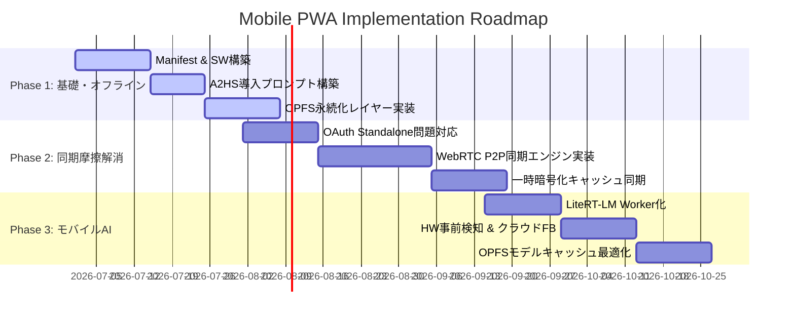

# Mobile PWA Development & Release Roadmap

このドキュメントは、「Midjourney Style Manager (style-atelier)」のモバイルPWA（Progressive Web App）展開に向けた、技術的フィージビリティ検証（[docs/pwa-technical-feasibility.md](file:///c:/Users/oculus/Desktop/worktrees/1174-mobile-pwa-roadmap/docs/pwa-technical-feasibility.md)）とマーケティング戦略・KPI（[memory-bank/marketingStrategy.md](file:///c:/Users/oculus/Desktop/worktrees/1174-mobile-pwa-roadmap/memory-bank/marketingStrategy.md)）を融合した公式ロードマップです。

ユーザーの知的財産（プロンプト）を保護するローカルファーストの精神を維持しつつ、デバイス間移行の摩擦を取り除き、モバイル環境での最高の「カード収集・管理（TCG）」体験を提供するための具体的なマイルストーンを定義します。

---

## 🗺️ ロードマップ全体像 (Roadmap Overview)

PWA化のプロジェクトは、技術的な複雑度とユーザーの導入摩擦（フリクション）を考慮し、以下の3つのフェーズに分けて段階的に実装・リリースします。

---

## 🛠️ 各フェーズの詳細要件と技術アプローチ

### Phase 1: Foundation, Standalone Shell & Offline Storage (基礎・オフライン化)

**目的**: モバイル単体でアプリとしてホーム画面に追加可能にし、ネットワークが無い環境でもPCから同期したカードやバインダーを高速に閲覧・整理できる土台を作ります。

- **具体的な機能要件**:
  1.  **Web App Manifest & アイコンアセットの整備**:
      - `manifest.json` を適切に構成し、`display: standalone`、`orientation: portrait` を指定。
      - TCGバインダーを模した「Atelier」のブランドアセットを活かしたマルチサイズアイコンの定義。
  2.  **Service Workerによるオフラインシェル**:
      - 静的アセット（HTML, JS, CSS, ローカライズ用JSONファイル等）のCache APIによるキャッシュ。
      - ネットワーク優先 / フォールバックキャッシュ戦略により、ローディング速度をPC同等以上に高速化。
  3.  **iOS/Safari 7日間ストレージ上限（7-Day Cap）対策**:
      - 標準Webサイトでは7日間未アクセスでIndexedDB等が削除されるWebKit制約に対応。
      - ユーザーがホーム画面にアプリを追加（A2HS: Add to Home Screen）するよう促す、iOS/Androidそれぞれのスマートインストール案内ダイアログの実装。STANDALONE起動時はこの制限が免除されるため、A2HSを活性化の第一関門と定義する。
  4.  **OPFS（Origin Private File System）ベースのストレージ**:
      - モバイルデバイスでのIndexedDB I/Oボトルネックと大容量画像データのメモリ圧迫を回避するため、OPFSに画像を直接保存する `useOpfsImage` フックとの統合。
- **KPIへの寄与**:
  - **KPI 2-2 (WAU継続率)**: オフライン対応と高速な閲覧性により、日常の「ポケットカード図鑑」としての実用性を高め、ユーザー離脱を防ぎます。
- **Exit Criteria**:
  - モバイルSafari/Chromeでホーム画面追加（A2HS）ができ、オフライン状態でアプリが正常に起動・動作すること。
  - OPFSにカード画像データが安全に永続化されること。

---

### Phase 2: Zero-Friction Hybrid Sync & Place Expansion (同期摩擦の解消)

**目的**: Google Driveなどの外部API依存によって生じる「OAuth認証の煩雑さ」「API Quota制限」「Standalone PWAにおける外部遷移によるセッションロスト」という致命的なPlace(流通)摩擦を排除します。

- **具体的な機能要件**:
  1.  **OAuth standaloneリダイレクト問題の解決**:
      - Google Identity Services (GIS) TokenClientを使用した **Popup flow** を強制。
      - 別窓ポップアップおよび iframe 通信（`postMessage`）を仲介し、PWA standaloneプロセスがバックグラウンドに追いやられたり、別ブラウザでセッションが復元されたりするのを防ぐセッション中継ハンドラの導入。
  2.  **QRコード & WebRTC (DataChannel) によるローカルP2P直接同期**:
      - クラウドサービスや外部アカウント（Google等）を介さず、PCのStyle Atelier画面に表示された同期QRコードをスマホカメラで読み取るだけで、同一LAN内のデバイス間でデータを直接シームレスに転送するWebRTC同期シグナリングの実装。
      - これにより、クラウド認証の手間（OAuthの離脱率12%）を完全に排除。
  3.  **一時的な認証不要の中間キャッシュ同期（Fallback）**:
      - WebRTCがNAT越え等で確立できない場合の代替案として、転送データを一時的にエンドツーエンド（E2E）暗号化し、パスコード（ピンコード）を介して一時サーバーで中継する軽量同期システムの導入。サーバー側は暗号化キーを持たないゼロナレッジ構成とする。
- **KPIへの寄与**:
  - **同期CVR（目標 25%+）**: OAuth認証の手間を省き、エラーの起きないP2P/一時キャッシュ同期を提供することで、PC-モバイル間の同期完了率を劇的に向上。
  - **KPI 1-1 (CWSインプレッション数)**: スマホからの流入者が「後でPCで使う」ための連携障壁をゼロにします。
- **Exit Criteria**:
  - A2HSで起動したPWA上で、OAuthリダイレクトを行わずにGoogle Driveとの同期が完結すること。
  - PCとモバイル間で、QRコードスキャンのみでWebRTC接続が確立し、カードデータ（JSON + OPFS画像バッチ）が5秒以内にP2P転送完了すること。

---

### Phase 3: Resilient Mobile AI Inference & Hybrid Fallback (モバイルAI・高レジリエンス)

**目的**: スマホの限られたリソース（iOS 1.5GB OOM Jetsam）の中で、プロンプトデータを漏洩させずに完全ローカルでカード化（Mint - アートスタイル分析）できる環境を、高い堅牢性（レジリエンス）で実現します。

- **具体的な機能要件**:
  1.  **LiteRT-LM (`@litert-lm/core`) の Web Worker Offloading**:
      - LLM推論処理中のメインスレッド（UI描画）ブロックを防ぐため、WASMランタイムと推論ループをすべてWeb Worker / Offscreen Document内に分離。
  2.  **デバイスのハードウェア特性の事前インテリジェント検知**:
      - `navigator.gpu` による WebGPU 利用可否の判別。
      - `navigator.deviceMemory`（Androidのみ）を利用したシステムRAM容量の検出。
  3.  **ハイブリッドクラウドフォールバック推論 (Dynamic Fallback)**:
      - ハードウェア事前検知の結果、以下に該当する場合はローカルLLMのダウンロードを行わず、自動的かつシームレスにクラウドAPI（例: Gemini API）へ処理をフォールバックする。
        - WebGPUが非サポートの場合（iOSのデフォルト設定等）。
        - デバイスメモリが3GB未満、またはOOMの危険性が極めて高いと判定された場合（iOS Safariプロセス制限に適合するため、iOSデバイスは原則クラウド優先）。
      - フォールバック時も、ユーザーに警告トーストや説明UIを明示し、ゼロトラストの懸念に対して透明性を担保する。
  4.  **OPFSを用いた大容量モデルのキャッシュストレージ管理**:
      - 2Bパラメーターのモデルファイル（約1.3GB〜1.5GB）のダウンロード時、Cache APIやIndexedDBを介さず、OPFSの `FileSystemSyncAccessHandle` を用いてダイレクトにファイルストリーミング保存とWASM読み込みを行い、ディスクI/Oボトルネックとブラウザのメインメモリ圧迫を極小化する。
- **KPIへの寄与**:
  - **KPI 2-1 (初回カード生成 Mint 完了率 目標80%+)**: LLMのモデル読み込みエラーやSafariの強制終了（Jetsam）による離脱をゼロにし、あらゆるモバイルデバイスで「カード化（Mint）のWow moment」を確実に達成します。
- **Exit Criteria**:
  - iOS Safari（WebGPUオフ）において、エラーを出さずに自動でクラウドAPIフォールバックが走り、プロンプト解析カード生成が成功すること。
  - WebGPU対応Android Chromeにおいて、Web Worker内のWebGPU-LiteRT-LMによるローカルAI推論が走り、メインスレッドをフリーズさせずにカード生成が成功すること。
  - 1GB超のモデルデータがOPFSを介してメモリプレッシャーを抑えつつロードされること。

---

## 📈 マイルストーン & 開発スケジュール (Milestones & Schedule)

| マイルストーン             | リリース時期 (目安) | 主な成果物                                                 | Exit Criteria                                                         |
| :------------------------- | :------------------ | :--------------------------------------------------------- | :-------------------------------------------------------------------- |
| **M1: Foundation**         | 2026年7月中旬       | Manifest, SWキャッシュ, OPFS対応UI, A2HSダイアログ         | オフラインPWA単体起動の成功、OPFSへのデータ永続化                     |
| **M2: Zero-Friction Sync** | 2026年8月中旬       | popup-GIS, WebRTCシグナリング, QR P2P UI                   | QRスキャンのみによるPC-モバイル間高速P2P同期の成功                    |
| **M3: Resilient AI**       | 2026年9月下旬       | Worker-LiteRT-LM, HW検知器, クラウドフォールバックロジック | iOSでの自動クラウドフォールバック、AndroidでのWorker WebGPU推論の成功 |

---

## 🏁 結論 & チームへの展開

本ロードマップの策定により、モバイルPWA展開は単なる「画面の移植」ではなく、**「Place摩擦を排除してCWSインプレッションをブーストし（M2）、デバイスメモリ制約の罠をインテリジェントに回避してWow momentを100%提供する（M3）グロース施策」**へと昇華されます。

次のアクションとして、本ロードマップのフェーズ計画に基づき、**M1（Foundation）の具体的な実装Issue（Web App Manifest의 定義、Service Workerでのキャッシュ戦略、A2HSプロンプトUI）**を起票し、順次実装エージェントへアサインします。
