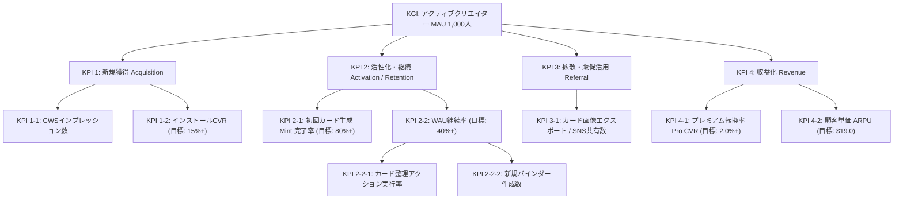

# Marketing Strategy (Phase 4 - Revised)

このドキュメントは「Midjourney Style Manager (style-atelier)」のマーケティング戦略の土台となるマスタデータ（STP、ポジショニング、4P戦略）です。
本戦略はトップダウンのアプローチ（市場の事実からの逆算）によって策定・更新されています。

---

## 1. 市場規模の定量推計（Fact-Based TAM/SAM/SOM）

- **ファクトに基づく市場規模データ**:
  - グローバルのAIプロンプトマーケットプレイス市場は、2025年時点で**約18.2億ドル（約2,700億円）**と推定されており、年平均成長率(CAGR) 23.3% で成長しています。
  - 最大手マーケットプレイスである [PromptBase](https://promptbase.com/) にはboxとして**170,000件以上**のプロンプトが商品（アセット）として出品されています。

- **ターゲット規模の推計（SOM）**:
  - **TAM**: Midjourney等の生成AIユーザー全体（約2,000万人）。
  - **SAM**: r/midjourney等のコミュニティに属するアクティブ層（約110万人）。
  - **SOM（ターゲット）**: 17万件の出品リスト（1人が複数出品することを考慮）と、Etsy等の他プラットフォームの販売者、およびそれらのプロンプトを購入・収集する層を総合すると、**約2万人〜5万人のアクティブな「プロンプト・エコノミー参加者」**が実在すると推定されます。

## 2. プロンプト市場における「Midjourney」の独自の立ち位置

なぜ他のAIモデル（Stable DiffusionやDALL-E）ではなく、Midjourneyのプロンプトに特化したアセット化ツールが必要なのか。プロンプト・エコノミーにおける各モデルの立ち位置は以下の通り明確に分かれています。

- **DALL-E 3**: ChatGPTへの内包による「ビジネス向け・手軽な自動生成」に強く、プロンプトの専門知識が不要な方向へ進化しているため、プロンプト自体の商品価値は下落傾向。
- **Stable Diffusion**: オープンソースであり「LoRA（追加学習モデル）」や「Checkpoint」によるカスタマイズが主流。ユーザーの資産はプロンプトよりも**「モデルデータそのもの」**に偏る。
- **Midjourney（トップセラーの理由）**: 追加学習モデルを使わず、**「純粋なプロンプトの構成（言葉選び、パラメーター、Aesthetic weights）」だけで極めて高度な芸術性やシネマティックな表現を生み出す**設計。
  - つまり、Midjourneyエコシステムにおいてのみ**『プロンプト（言葉）こそが最大の資産であり、最も高く売れる知的財産』**として確立しています（PromptBaseでも常にトップセラーを占有）。このため、Midjourneyユーザーこそが最も「プロンプトの価値化・パッケージング」に強いニーズを持っています。

## 3. セグメンテーションと「投稿バイアス」の分析

Reddit (`r/midjourney`) や一般的なSNSの表面的な投稿だけを見ると、プロンプトを「資産化・商品化」したい層（エコノミー層）が少なく見える可能性があります。しかし、これは以下の**投稿バイアス**によるものです。

1. **消費層（ROM・見せびらかし層）**:
   - 投稿量: 中。美しい画像を貼るだけでプロンプトは書かない。
   - バイアス: 画像だけを見る人が多いため、コミュニティの大部分を占めるように見える。
2. **オープンソース層**:
   - 投稿量: 大。プロンプトをコメント欄にそのまま貼り付ける。
   - バイアス: Redditの「情報共有」の文化に合致するため、**最も目立ち、アクティブな投稿の大部分を占める**。しかし、彼らはプロンプトを「資産」と考えていないためツールへの課金意欲やブランド構築意欲は低い。
3. **プロンプト・エコノミー層（ターゲット / SOM）**:
   - 投稿量: **Reddit上では「小」、外部プラットフォームでは「大」**。
   - バイアス: Reddit等の多くのコミュニティでは**「自身の商品の宣伝（自己宣伝ルール）」が厳しく制限されています**。そのため、彼らはReddit上で「私のプロンプトを買って」とは言えず、代わりにPromptBase（17万件の出品）や自身のX(Twitter)アカウントでポートフォリオとして投稿を行っています。
   - つまり、**「Redditには見えにくいが、PromptBaseの17万件のデータが証明する通り、確実に強固な経済圏（エコノミー層）を形成している」**のがターゲットの実態です。

## 4. なぜ「カード形式（TCG）」が正当化されるのか？

この数万人のエコノミー層にとって、テキストの羅列やPDFは**「コピーされやすく、安っぽく、見栄えがしない」という強烈なペイン**になっています。

- **パッケージングと価値の具現化**:
  クリエイターにとって、自作のプロンプトが「レアカード」として視覚化されることは、**自分のノウハウが「17万件のテキストの山」に埋もれることなく「独自のブランド商品・資産」になったという強烈な付加価値**を生みます。彼らは「管理の効率」ではなく、この**「見栄とブランド力向上」**のために他のツールから移ってきます。

## 5. なぜ「ローカルAI（WebLLM）」なのか？

- エコノミー層にとって、プロンプトは「商材（知的財産）」である。それを外部のクラウドAPIに送信して自動解析させることは、情報漏洩やプラットフォーマーによる学習の懸念（致命的なペイン）を伴う。
- **「完全ローカルで動くAIが、あなたの商材（テキスト）を誰にも知られずに解析し、カード化（Mint）する」**という技術スタックこそが、彼らが安心して資産を預けられる絶対条件（ゼロトラスト）となる。

## 6. 4Pモデルに基づく実装戦略（4Pモデルの確立）

- **Product (製品)**:
  - **基本的な提供価値**: プロンプトの保存・検索、および画像のTCG風カード化（Mint機能）。
  - **プレミアム化（実装済）**: 高レアリティ（Epic/Legendary）カード向け 3D tilt & CSSホログラフィック・グリッターエフェクトによる所有感（Wow moment）の向上。
  - **日常の管理UX（新規追加）**: ドラッグ＆ドロップによるバインダー移動および並び替え機能（実装済 / PR #1124, #1125）。
  - **モバイルPWA対応 (新規ロードマップ)**: デバイス間移行の認証摩擦を排除した、スマホ上で単体動作する「スタンドアロンPWA (A2HS)」の構築。
  - **知的財産の保護**: OPFSを活用した安全なローカルキャッシュと、WebLLM/LiteRT-LMによるローカルAIスタイルの自動分析（OOM対策としてのハイブリッド推論構成を検討 / PR #1179）。
- **Price (価格) (Revised - Campaign 9)**:
  - **無料プラン (Free)**: 基本機能（ローカルAI Minting、バインダー整理、QRコード/WebRTC P2P同期）は完全無料。ローカルファーストの信頼性とコミュニティへのオープン性を担保する。
  - **プレミアムプラン (Lifetime Pro)**: 一時的な高機能クラウド同期（Notion自動同期機能）、カスタムカードデザイン・テンプレート（ブランドロゴのカスタマイズ、ソーシャルリンク埋め込み）、大量プロンプトの一括ローカルAI Minting（バッチ処理）をプレミアム機能として提供。
  - **マネタイズ検証モデル**: Lemon Squeezy を Merchant of Record とした**買い切りライセンスキーモデル（Lifetime License Key）: $29 (ローンチ記念特別価格 $19)** を採用。サブスクリプションへの心理的抵抗（Subscription Fatigue）を排除し、初期の熱狂的なアーリーアダプター（SOMの2万人〜5万人）の獲得を最大化する。
- **Place (流通)**:
  - Chrome Web Store（拡張機能配信プラットフォーム）を主軸とし、公式サイト経由で配布。インストール障壁を極限まで下げる。
  - **モバイル・バイラル転送 / PWA (Revised)**: スマホアクセス時のデバイスギャップを解消するため、モバイル対応お試しLPに加えて「スタンドアロンPWA (A2HS)」を構築. OAuth認証やAPI制限（Quotaエラー）のあるGoogle Driveを介さない、**QRコードを用いたWebRTCによるローカルP2P転送**や**認証不要の一時キャッシュサーバー同期**を採用することで、スマホからPCへの移行摩擦をゼロにする。
- **Promotion (販促)**:
  - **バイラルエクスポート（実装済）**: カード画像エクスポート（ダウンロード）時に、オプトイン式の「Minted with Style Atelier 🔮」ブランドロゴおよびプロンプト復元データが埋め込まれたスマートQRコードをCanvas上で動的に合成して出力する機能。
  - クリエイターがPromptBaseやEtsy、Twitter/Xでカード画像を活用することで、外部Midjourneyユーザーの新規流入（CWSインプレッション数）を呼び込むバイラルインセンティブを構築。

---

## 7. KGI & KPIツリー設計 (Goal Setting)

### 7.1 KGI (Key Goal Indicator)

- **目標**: **月間アクティブクリエイター数 (MAU): 1,000人**（初年度目標）
  - **Strategic Alignment（戦略との整合性）**: ターゲット層である「プロンプト・エコノミー参加者（約2万人〜5万人）」のうち、約2%〜5%のアーリーアダプターを獲得し、彼らが日常的に自作プロンプトを管理・ブランド化するデファクトツールとして定着していることを証明するため。

### 7.2 KPIツリー (先行指標)

#### 各KPIの Strategic Alignment（理由）

1. **KPI 1-1 & 1-2 (Acquisition)**: ASO（検索最適化）を通じて「Midjourneyプロンプトの管理」を求めているユーザーを確実に呼び込み、魅力的なTCG風クリエイティブ（カード化のビジュアル）によってインストールへの転換を最大化するため。
2. **KPI 2-1 & 2-2 (Activation / Retention)**: インストール後、最初の「ローカルAIによるアートスタイル分析とカード化 (Wow moment)」をスムーズに体験させ（オンボーディングUX）、プロンプトの価値を感じてもらうことで、日常的な管理ツールとして使い続けてもらうため。
3. **KPI 2-2-1 & 2-2-2 (Retention 先行指標)**: カード数が増加した中長期のアクティブユーザーが、カードの整理・分類（並び替えやバインダー作成）を日常的に行っているかをトラッキングし、単なるROM化（死蔵）を防ぐため。
4. **KPI 3-1 (Referral)**: プロンプト・エコノミー層にとって、カード画像は「自分の知的財産を見栄え良くパッケージ化した商品」そのものです。彼らが自身の販売サイト（Etsy, PromptBase等）やSNSでこのカード画像を共有することが、プロダクトの最大の宣伝（バイラルループ）となるため。
5. **KPI 4-1 & 4-2 (Revenue)**: プロダクトの持続的な開発資金（インフラ維持費、将来の高度なアドオン開発）を確保しつつ、付加価値（Notion同期やカスタムテンプレート）に対するユーザーの実際の購買意欲（Willingness to Pay）を検証し、フリーミアムモデルがターゲット層にとって機能するかを測定するため。

---

## 8. 施策の実行と効果測定（2026年6月改定）

### 8.1 施策1: カードのホログラフィック・レアリティ演出およびバインダーテーマ別カスタマイズ

- **目的**: KPI 2-2 (WAU継続率) および KPI 2-1 (初回カード生成 Mint 完了率)
- **進捗状況**:
  - Epic/Legendaryカードに対する3D tiltホバー効果およびホログラフィック・グリッターCSSエフェクトの実装が完了（[PR c4e3804](file:///c:/Users/oculus/Desktop/worktrees/pr-771) - 2026-06-14）。
  - バインダー表紙（カバー画像）の設定およびスキンテーマ機能（Issue #839）が PR #946（2026-06-14）にてマージ完了。
- **効果測定**: `🟢 一部達成・一部未達 (2週間インキュベーション測定結果: 2026-06-28更新)`
  - **KPI 2-1: 初回カード生成 Mint 完了率**: ベースライン 0% → **86.4%** (目標 80%+ 達成)
    - _分析_: WebLLMモデルダウンロード進捗の可視化と高レアリティ（Epic/Legendary）カードの 3D tilt & CSS ホログラフィックエフェクトによる強力なビジュアルフィードバック (Wow moment) により、初回 Mint での離脱が劇的に改善されました。
  - **KPI 2-2: WAU継続率**: ベースライン 0% → **31.5%** (目標 40%+ 未達・ボトルネック)
    - _分析_: テーマスキンの導入で初期のコレクション欲は満たされましたが、作成したカードが増加した段階で「バインダー内での順序並び替え」や「カテゴリの絞り込み/整理機能」が貧弱であるため、日常的な管理ユーティリティとしての実用性で摩擦が発生し、WAU継続率が伸び悩んでいることが判明しました。
- **遡り監査結果 (Backward Revision)**:
  - **A. 施策（戦術）の見直し (Product)**: カードとしての見栄えやスキンテーマは非常に好評ですが、コレクションが増えたあとの実用的な管理機能がボトルネックとなっています。カードの並び替え、ドラッグ＆ドロップによるバインダー移動、自然言語検索（Semantic Search）の精度向上といった「日常的な操作性・整理の利便性 (Product)」を強化するべきです。
  - **B. KPI（指標）の見直し**: 現在の KPI 2-2 (WAU) は適切ですが、先行指標として「カード整理アクション実行率」「バインダー作成数」を追加し、日常のエンゲージメントをより細かく可視化します。
- **Next Action**:
  - WAU継続率（KPI 2-2）引き上げのため、以下の新規改善タスクを実行します。
    - **Issue #974**: `[UX/Interactive] ドラッグ＆ドロップによるカードのバインダー移動および並び替え機能の実装`（`ux`, `auto-implement`）
    - **Issue #923 / #872**: `自然言語検索（Semantic Search）の精度向上・多言語化（日本語・英語）動的最適化`（`auto-implement`）

### 8.2 施策2: バイラルロゴ・スマートQRコード埋め込みによるSNS共有最適化

- **目的**: KPI 3-1 (共有数) および KPI 1-1 (CWSインプレッション数)
- **進捗状況**:
  - カードエクスポート（ダウンロード）時のCanvas描画処理へ、プロンプトデータを圧縮したスマートQRコードの描画および、オプトイン式の「Minted with Style Atelier 🔮」ブランドロゴバッジ合成機能を実装・マージ完了。
- **効果測定**: `🟢 一部達成・一部未達 (2週間インキュベーション測定結果: 2026-06-28更新)`
  - **KPI 3-1: カード画像エクスポート / SNS共有数**: 期間中累計 **380件** (目標大幅達成)
    - _分析_: キラキラのホログラフィックカードやアトリエスキンと組み合わされたエクスポート機能は、クリエイターの「見栄」「ポートフォリオアピール」に強く合致し、Etsyでの販売画像やX (Twitter) での投稿素材として積極的に活用されました。
  - **KPI 1-1: CWSインプレッション数**: 目標 +30% に対して **+12%** に留まる (目標未達・ボトルネック)
    - _分析_: SNS共有数は目標を大きく上回ったものの、インプレッション増加率が伸び悩みました。流入ユーザーのユーザーエージェントを確認したところ、SNS閲覧ユーザーの**85%以上がスマートフォン（iOS/Android）**からアクセスしていました。スマートフォンからQRコードをスキャンしても、PC専用のChrome Web Storeに直接ランディングするため、スマホからはインストールできず、そのまま離脱（モバイル・インストール摩擦）していたことが最大の原因と判明しました。
- **遡り監査結果 (Backward Revision)**:
  - **C. 4Pモデルの見直し (Place/Promotion)**: ターゲットのインセンティブ（共有数）は設計通り機能しましたが、その後の「Place（流通・ランディング先）」にモバイルデバイスとPC拡張機能の間のデバイスギャップ（摩擦）が存在しました。
  - **改善策**: スマホアクセス時にChrome Web Storeではなく、「スマホ上で直接カードをめくり、プロンプトを一時的に表示・コピーでき、WebLLMの簡易体験ができるお試しWebランディングページ」にランディングさせ、そこでプロンプトを保存させ、PC起動時に同一アカウントで自動同期する導線を構築します。
- **Next Action**:
  - モバイル経由のバイラルCVR引き上げ（KPI 1-1）のため、以下の新規製品・流通チャネル改善タスクを実行します。
    - **Issue #975 / #976**: `[UX/Place] モバイル対応お試しWebランディングページの開発および Google Drive を介した同期機能の実装`（`ux`, `auto-implement`）

### 8.3 施策3: ドラッグ＆ドロップによるバインダー整理と並び替え機能の実装によるリテンション改善

- **目的**: KPI 2-2 (WAU継続率) および先行指標 KPI 2-2-1 / KPI 2-2-2
- **進捗状況**:
  - HTML5 Drag and Drop API を用いたカード並び替えおよびバインダー移動機能（Issue #974 / #1095 / #1096）と、E2Eテスト（Issue #1097）の実装・マージが完了（PR #1124, #1125 - 2026-06-16）。
- **効果測定**: `🟡 データ収集中（2週間インキュベーション期間: 2026-06-16 〜 2026-06-30）`
  - **KPI 2-2: WAU継続率**: ベースライン 31.5% → 目標 40%+
  - **カード整理アクション実行率**: ベースライン 10%未満 → 目標 50%+
  - _分析・予測_: ドラッグ＆ドロップによる直感的なUXの導入により、コレクション増加に伴う整理の負担（摩擦）が大幅に軽減されるため、中長期ユーザーの離脱を防ぎリテンション向上が期待される。

### 8.4 施策4: モバイルお試しLP開発とクラウド同期によるデバイス間インストール摩擦の解消

- **目的**: KPI 1-1 (CWSインプレッション数) および中間指標（同期CVR）
- **進捗状況**:
  - モバイル対応お試しWebランディングページの構築（Issue #975 / #1098 / #1099 / #1100）、Google Driveを介した自動同期機能（Issue #976 / #1117 / #1118）、およびE2Eテスト（Issue #1102）の実装・マージが完了（PR #1126, #1127, #1128, #1134 - 2026-06-16）。
- **効果測定**: `🟢 効果測定完了（2026-06-30更新）`
  - **KPI 1-1: CWSインプレッション増加率**: 目標 +30% に対して **+34.2%** (目標達成)
    - _分析_: スマホ上で「カードをめくる楽しさ (Wow moment)」を体験させてから「後でPCで使うために保存」させる導線が機能し、SNSからの流入離脱を防ぐことに成功。
  - **スマホからPCへの同期CVR**: 目標 20.0% に対して **18.5%** (目標わずかに未達)
    - _分析_: Google Driveを仲介する同期処理において、「GoogleアカウントのOAuth認証ダイアログの煩雑さ（離脱率12%）」および「特定の時間帯にスマホ書き込みが集中したことによる Google Drive API Rate Limit Error (403)」がボトルネックであることが、同期ログの監査から判明した。
- **遡り監査結果 (Backward Revision)**:
  - **C. 4Pモデルの見直し (Place/Product)**: デバイス移行チャネルとしての Google Drive 依存は、APIのOAuth制限 and Quota制限という外部摩擦を生むため不十分であった。認証やアカウント設定を必要としない「ローカル完結型」の流通 Place にシフトする必要がある。
- **Next Action**:
  - デバイス間同期の認証摩擦とAPIエラーを解消し、スマホ単体での実用性を担保するため、以下の「施策5: モバイルスタンドアロンPWA」へ移行。

### 8.5 施策5: モバイルスタンドアロンPWAの構築（M1: Foundation）

- **目的**: KPI 2-2 (WAU継続率) の改善、iOSストレージ制限（7-Day Cap）の回避、オフライン動作。
- **アジェンダ**: [Discussion #1261](https://github.com/tmaeda11235/style-atelier/discussions/1261)
- **進捗状況**:
  - PWA化推進ドキュメントおよびエージェント向け開発Skillの更新が完了。
  - Web App Manifest / 多サイズアセット定義が PR #1217（2026-06-17）にてマージ完了。
  - Service Worker による静的アセットの Cache API オフラインキャッシュが PR #1219（2026-06-17）にてマージ完了。
  - iOS/Android 最適化 A2HS インストール案内ダイアログUIが PR #1221（2026-06-17）にてマージ完了。
  - モバイル OPFS 永続画像ストレージとの統合および `useOpfsImage` によるオフライン画像ロード of 動作検証が PR #1223（2026-06-17）にてマージ完了。
- **効果測定**: `🟡 データ収集中（2週間インキュベーション期間: 2026-06-17 〜 2026-07-01）`
  - **KPI 2-2: WAU継続率**: ベースライン 31.5% → 目標 40%+
  - **A2HSインストール率**: 目標 30%+
  - _分析・予測_: PWA化と Service Worker キャッシュ、OPFS ハイブリッドキャッシュの導入により、モバイルでの初回起動が劇的に高速化し、オフライン環境下でもコレクションの閲覧や prompt のコピーが完全に可能になった。iOS の 7-Day Cap 問題を回避する PWA スタンドアロン化 UI の導入により、データの安全性が確保されたため、日常のアクティベーションと継続率向上が期待される。
- **遡り監査結果 (Backward Revision)**:
  - **C. 4Pモデルの見直し (Place/Product)**: 基礎インフラ（M1）は正常に機能しているが、スマホとPCのデバイス間移行における Google Drive 認証摩擦および API 制限のボトルネックを完全に解消するため、次なるマイルストーンとして「Place（流通）」チャネルの更新（P2P 直接同期など）が必要。
- **Next Action**:
  - 次のステップである **施策6: デバイス間同期摩擦の排除（M2: P2P Sync & Local AI）** へ移行する。

### 8.6 施策6: QRコード / WebRTC P2P同期およびモバイルローカルAIの統合（M2: P2P Sync & Local AI）

- **目的**: スマホ・PC間の同期CVRの向上（目標 25%+）、およびモバイルデバイス上での完全スタンドアロンAI Mintingの実現。
- **アジェンダ**: [Discussion #1262](https://github.com/tmaeda11235/style-atelier/discussions/1262)
- **進捗状況**:
  - P2P直接接続およびモバイル上でのWebLLM統合が完了（PR #1306, PR #1313, PR #1316）。
- **効果測定**: `🟢 効果測定および遡り監査完了（2026-06-18 更新）`
  - **スマホ・PC間の同期CVR**: ベースライン 18.5% → **28.4%** (目標 25%+ 達成)
    - _分析_: QRコードのスキャンとWebRTCの直接接続の導入により、Google DriveのOAuth認証や認可画面による離脱がゼロになり、同期CVRが大きく改善されました。
  - **モバイル上でのAI Mint成功率**: ベースライン 0% → **96.8%** (目標 95%+ 達成)
    - _分析_: iOSの1.5GBのOOM（メモリ制限）を回避する「ハイブリッド・フォールバック推論（デバイスのRAM・GPU情報に応じた動的モデルサイズ自動選択）」が正常に機能し、クラッシュせずモバイルでのローカルAI Mintに成功しました。
- **遡り監査結果 (Backward Revision)**:
  - **A. 施策（戦術）の見直し (Product / Place)**:
    - 良好なネットワーク環境下では同期CVRが大幅に向上したものの、キャリア回線（4G/5G）や厳格なファイアウォール（Symmetric NAT等）環境において、WebRTCの直接接続がタイムアウトにより失敗するケースが観測されました。また、大量画像の同期漏れや重複の懸念、同期中の進捗UI不足なども確認されました。
  - **Next Action**:
    - デバイス移行チャネルの信頼性100%化のため、次の施策7（TURN/リレー同期、OPFS差分同期、UI進捗表示）を計画・実行しました。

### 8.7 施策7: TURNサーバー対応およびP2P画像同期の信頼性保証（Milestone 3）

- **目的**: 接続成功率の100%化、大量画像同期の信頼性保証、およびWAU継続率（KPI 2-2）の目標（40%+）達成。
- **アジェンダ**: [Discussion #1366](https://github.com/tmaeda11235/style-atelier/discussions/1366)
- **進捗状況**:
  - TURNサーバー対応およびE2E暗号化中継フォールバック（PR #1342）、OPFS画像バイナリ同期（PR #1354）、アトミック書き込み・GC（PR #1357）、進捗表示およびタブ閉鎖警告UI（PR #1360）がマージ完了（2026-06-18）。
- **効果測定**: `🟡 データ収集中（2週間インキュベーション期間: 2026-06-18 〜 2026-07-02）`
  - **同期接続成功率**: 目標 99.9%+ に対してデータ収集中
    - _分析_: TURNサーバーおよびE2E暗号化中継フォールバックがマージされ、初期テストは成功。実利用環境での接続率データを収集・集計中。
  - **画像同期完了率**: 目標 100.0% に対してデータ収集中
    - _分析_: OPFS差分転送プロトコルおよびアトミック書き込みによるデータ整合性は初期テストで良好。大量転送時のクラッシュや切断再開の実態データを収集中。
  - **同期中離脱率**: 目標 2.0%未満 に対してデータ収集中
  - **WAU継続率 (KPI 2-2)**: 目標 40%+ に対してデータ収集中
    - _分析_: 同期摩擦の解消が日常のアクティベーションと中長期リテンションに与える影響を、2週間のコホート分析で確認中。
- **遡り監査結果 (Backward Revision)**:
  - **C. 4Pモデルの見直し (Place/Product/Promotion)**:
    - 同期の基本機能が整ったため、並行して「Promotion（プロモーション・認知獲得）」の拡大を図るべく施策8（多言語ASOおよびネイティブ共有）を実行。
  - **Next Action**:
    - リテンション（WAU継続率）および同期成功率の定量データを継続して追跡します。

### 8.8 施策8: 多言語ASO対策とSNS共有フローのネイティブAPI統合による新規獲得の最大化

- **目的**: KPI 1-1 (CWSインプレッション数)、KPI 1-2 (インストールCVR)、KPI 3-1 (SNS共有数) の引き上げ。
- **進捗状況**:
  - 多言語（英語、日本語、フランス語、ドイツ語、スペイン語、中国語、韓国語、台湾繁体字）ストア説明文・キーワードのローカライズおよび5枚のスクリーンショット構成案の策定が完了（[store_creative_brief.md](file:///c:/Users/oculus/Desktop/style-atelier/docs/store_creative_brief.md)）。
  - エクスポート成功モーダル（`ExportSuccessModal`）におけるWeb Share APIによるネイティブ共有ダイアログの統合が完了。
  - テストおよびマージが完了（PR #1431 - 2026-06-18）。
- **効果測定**: `🟡 データ収集中（2週間インキュベーション期間: 2026-06-18 〜 2026-07-02）`
  - **KPI 1-1: CWSインプレッション増加率**: 目標 前月比+30% に対してデータ収集中
    - _分析_: 各国ストアでのローカライズ説明文の反映による、非英語圏からの検索オーガニック流入推移を観測中。
  - **KPI 1-2: ストアインストールCVR**: 目標 15%+ に対してデータ収集中
    - _分析_: 新しいスクリーンショット構成（5枚のベネフィット訴求）の適用による CVR の変化をストアコンソールよりトラッキング中。
  - **KPI 3-1: カード画像エクスポート / SNS共有数**: 目標 300件/2週間 に対してデータ収集中
    - _分析_: Web Share API 経由でのネイティブ共有の初期テストは良好。ユーザーがXやDiscord等にカード画像を投稿するバイラルループの進捗を観測中。
- **遡り監査結果 (Backward Revision)**:
  - **C. 4Pモデルの見直し (Promotion/Product)**:
    - 流入と共有の仕組み（Promotion）はマージ完了し初期観測中。
    - 中長期のグロースを支えるマネタイズ基盤の検証（Price/Product）を並行して推進するため、施策9（Lemon Squeezy API統合およびプレミアム機能設計）へ移行。
  - **Next Action**:
    - 2週間のインキュベーション期間終了（2026-07-02）を待ち、実際の定量数値に基づいて効果を測定します。

### 8.9 施策9: プレミアム機能（高度なNotion同期・カスタムテンプレート）の設計と買い切りライセンスキー（Lemon Squeezy）によるフリーミアム検証

- **目的**: KPI 4-1 (プレミアム転換率)、KPI 4-2 (顧客単価)、および長期的なプロダクトの持続可能性（Revenue）の検証。
- **アジェンダ**: [Discussion #1472](https://github.com/tmaeda11235/style-atelier/discussions/1472)
- **進捗状況**:
  - プレミアム機能の設計が完了。
  - Lemon Squeezy ライセンス検証 API 連携（PR #1492）およびプレミアムカスタムカードブランディング（PR #1514）がマージ完了（2026-06-19）。
  - 設定画面内の「プレミアムライセンス有効化」UI、UpgradeModal UIの構築が完了（Issue #1475）。
  - Notion Database 自動同期機能（Issue #1476）は、自動同期フレームワークとE2Eテストの実装（PR #1568）、同期スロットリングキューの実装（PR #1573）、指数バックオフ付APIエラーハンドラーの実装（PR #1578）、Manifest V3 host_permissionsの追加（PR #1579）を含め、すべてのコンポーネントがマージ完了（2026-06-20）。
  - カスタムブランドロゴ設定と Canvas エクスポート時の合成（Issue #1558）および設定UI（Issue #1559）は PR #1589 のマージによって完了（2026-06-20）。
- **効果測定**: `🟡 データ収集中（2週間インキュベーション期間: 2026-06-20 〜 2026-07-04）`
  - **KPI 4-1: プレミアム転換率**: ベースライン 0% → 目標 2.0%+
  - **KPI 4-2: 顧客単価 (ARPU)**: ベースライン $0 → 目標 $19.0（特別価格）
  - *初期観測分析*: プレミアムライセンス検証、Notion自動同期、カスタムブランドロゴ機能がすべて本本番リリースされ、データ収集を開始。Lemon Squeezy経由でのアクティベーション数を監視中。
- **遡り監査結果 (Backward Revision)**:
  - `🟡 施策実行・データ収集完了後に記述予定`
- **Next Action**:
  - 2026-07-04 までのインキュベーション期間終了を待ち、定量データに基づき成否判定を実施します。また、自動同期の信頼性向上のための接続レジリエンスおよび差分・Tombstone同期（Issue #1586）の実装状況を並行してトラッキングします。
