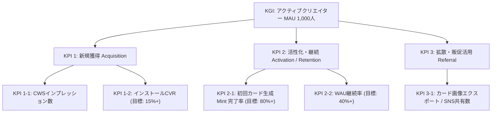

# Marketing Strategy (Phase 2 - Revised)

このドキュメントは「Midjourney Style Manager (style-atelier)」のマーケティング戦略の土台となるマスタデータ（STP、ポジショニング、4P戦略）です。
本戦略はトップダウンのアプローチ（市場の事実からの逆算）によって策定・更新されています。

---

## 1. 市場規模の定量推計（Fact-Based TAM/SAM/SOM）

- **ファクトに基づく市場規模データ**:
  - グローバルのAIプロンプトマーケットプレイス市場は、2025年時点で**約18.2億ドル（約2,700億円）**と推定されており、年平均成長率(CAGR) 23.3% で成長しています。
  - 最大手マーケットプレイスである [PromptBase](https://promptbase.com/) にはboxとして**170,000件以上**のプロンプトが商品（アセット）として出品されています。

- **ターゲット規模の推計（SOM）**:
  - **TAM**: Midjourney等の生成AIユーザー全体（約2,000万人）。
  - **SAM**: r/midjourney等のコミュニティに属するアクティブ層（約110万人）。
  - **SOM（ターゲット）**: 17万件の出品リスト（1人が複数出品することを考慮）と、Etsy等の他プラットフォームの販売者、およびそれらのプロンプトを購入・収集する層を総合すると、**約2万人〜5万人のアクティブな「プロンプト・エコノミー参加者」**が実在すると推定されます。

## 2. プロンプト市場における「Midjourney」の独自の立ち位置

なぜ他のAIモデル（Stable DiffusionやDALL-E）ではなく、Midjourneyのプロンプトに特化したアセット化ツールが必要なのか。プロンプト・エコノミーにおける各モデルの立ち位置は以下の通り明確に分かれています。

- **DALL-E 3**: ChatGPTへの内包による「ビジネス向け・手軽な自動生成」に強く、プロンプトの専門知識が不要な方向へ進化しているため、プロンプト自体の商品価値は下落傾向。
- **Stable Diffusion**: オープンソースであり「LoRA（追加学習モデル）」や「Checkpoint」によるカスタマイズが主流。ユーザーの資産はプロンプトよりも**「モデルデータそのもの」**に偏る。
- **Midjourney（トップセラーの理由）**: 追加学習モデルを使わず、**「純粋なプロンプトの構成（言葉選び、パラメーター、Aesthetic weights）」だけで極めて高度な芸術性やシネマティックな表現を生み出す**設計。
  - つまり、Midjourneyエコシステムにおいてのみ**『プロンプト（言葉）こそが最大の資産であり、最も高く売れる知的財産』**として確立しています（PromptBaseでも常にトップセラーを占有）。このため、Midjourneyユーザーこそが最も「プロンプトの価値化・パッケージング」に強いニーズを持っています。

## 3. セグメンテーションと「投稿バイアス」の分析

Reddit (`r/midjourney`) や一般的なSNSの表面的な投稿だけを見ると、プロンプトを「資産化・商品化」したい層（エコノミー層）が少なく見える可能性があります。しかし、これは以下の**投稿バイアス**によるものです。

1. **消費層（ROM・見せびらかし層）**:
   - 投稿量: 中。美しい画像を貼るだけでプロンプトは書かない。
   - バイアス: 画像だけを見る人が多いため、コミュニティの大部分を占めるように見える。
2. **オープンソース層**:
   - 投稿量: 大。プロンプトをコメント欄にそのまま貼り付ける。
   - バイアス: Redditの「情報共有」の文化に合致するため、**最も目立ち、アクティブな投稿の大部分を占める**。しかし、彼らはプロンプトを「資産」と考えていないためツールへの課金意欲やブランド構築意欲は低い。
3. **プロンプト・エコノミー層（ターゲット / SOM）**:
   - 投稿量: **Reddit上では「小」、外部プラットフォームでは「大」**。
   - バイアス: Reddit等の多くのコミュニティでは**「自身の商品の宣伝（自己宣伝ルール）」が厳しく制限されています**。そのため、彼らはReddit上で「私のプロンプトを買って」とは言えず、代わりにPromptBase（17万件の出品）や自身のX(Twitter)アカウントでポートフォリオとして投稿を行っています。
   - つまり、**「Redditには見えにくいが、PromptBaseの17万件のデータが証明する通り、確実に強固な経済圏（エコノミー層）を形成している」**のがターゲットの実態です。

## 4. なぜ「カード形式（TCG）」が正当化されるのか？

この数万人のエコノミー層にとって、テキストの羅列やPDFは**「コピーされやすく、安っぽく、見栄えがしない」という強烈なペイン**になっています。

- **パッケージングと価値の具現化**:
  クリエイターにとって、自作のプロンプトが「レアカード」として視覚化されることは、**自分のノウハウが「17万件のテキストの山」に埋もれることなく「独自のブランド商品・資産」になったという強烈な付加価値**を生みます。彼らは「管理の効率」ではなく、この**「見栄とブランド力向上」**のために他のツールから移ってきます。

## 5. なぜ「ローカルAI（WebLLM）」なのか？

- エコノミー層にとって、プロンプトは「商材（知的財産）」である。それを外部のクラウドAPIに送信して自動解析させることは、情報漏洩やプラットフォーマーによる学習の懸念（致命的なペイン）を伴う。
- **「完全ローカルで動くAIが、あなたの商材（テキスト）を誰にも知られずに解析し、カード化（Mint）する」**という技術スタックこそが、彼らが安心して資産を預けられる絶対条件（ゼロトラスト）となる。

## 6. 4Pモデルに基づく実装戦略（4Pモデルの確立）

- **Product (製品)**:
  - **基本的な提供価値**: プロンプトの保存・検索、および画像のTCG風カード化（Mint機能）。
  - **プレミアム化（実装済）**: 高レアリティ（Epic/Legendary）カード向け 3D tilt & CSSホログラフィック・グリッターエフェクトによる所有感（Wow moment）の向上。
  - **知的財産の保護**: OPFSを活用した安全なローカルキャッシュと、WebLLM (Gemma) によるローカルAIスタイルの自動分析。
- **Price (価格)**:
  - 基本機能は完全無料（オープンソースおよびローカルファーストの信頼性を担保するため）。将来的な高度なアドオン機能（Notion自動同期など）の開発に備え、フリーミアム、あるいは買い切りライセンスキーモデルの拡張を視野に入れる。
- **Place (流通)**:
  - Chrome Web Store（拡張機能配信プラットフォーム）を主軸とし、GitHubリポジトリおよび公式サイト経由で配布。インストール障壁を極限まで下げる。
- **Promotion (販促)**:
  - **バイラルエクスポート（実装済）**: カード画像エクスポート（ダウンロード）時に、オプトイン式の「Minted with Style Atelier 🔮」ブランドロゴおよびプロンプト復元データが埋め込まれたスマートQRコードをCanvas上で動的に合成して出力する機能。
  - クリエイターがPromptBaseやEtsy、Twitter/Xでカード画像を活用することで、外部Midjourneyユーザーの新規流入（CWSインプレッション数）を呼び込むバイラルインセンティブを構築。

---

## 7. KGI & KPIツリー設計 (Goal Setting)

### 7.1 KGI (Key Goal Indicator)

- **目標**: **月間アクティブクリエイター数 (MAU): 1,000人**（初年度目標）
  - **Strategic Alignment（戦略との整合性）**: ターゲット層である「プロンプト・エコノミー参加者（約2万人〜5万人）」のうち、約2%〜5%のアーリーアダプターを獲得し、彼らが日常的に自作プロンプトを管理・ブランド化するデファクトツールとして定着していることを証明するため。

### 7.2 KPIツリー (先行指標)

#### 各KPIの Strategic Alignment（理由）

1. **KPI 1-1 & 1-2 (Acquisition)**: ASO（検索最適化）を通じて「Midjourneyプロンプトの管理」を求めているユーザーを確実に呼び込み、魅力的なTCG風クリエイティブ（カード化のビジュアル）によってインストールへの転換を最大化するため。
2. **KPI 2-1 & 2-2 (Activation / Retention)**: インストール後、最初の「ローカルAIによるアートスタイル分析とカード化 (Wow moment)」をスムーズに体験させ（オンボーディングUX）、プロンプトの価値を感じてもらうことで、日常的な管理ツールとして使い続けてもらうため。
3. **KPI 3-1 (Referral)**: プロンプト・エコノミー層にとって、カード画像は「自分の知的財産を見栄え良くパッケージ化した商品」そのものです。彼らが自身の販売サイト（Etsy, PromptBase等）やSNSでこのカード画像を共有することが、プロダクトの最大の宣伝（バイラルループ）となるため。

---

## 8. 施策の実行と効果測定（2026年6月改定）

### 8.1 施策1: カードのホログラフィック・レアリティ演出およびバインダーテーマ別カスタマイズ

- **目的**: KPI 2-2 (WAU継続率) および KPI 2-1 (初回カード生成 Mint 完了率)
- **進捗状況**:
  - Epic/Legendaryカードに対する3D tiltホバー効果およびホログラフィック・グリッターCSSエフェクトの実装が完了（[PR c4e3804](file:///c:/Users/oculus/Desktop/worktrees/pr-771) - 2026-06-14）。
  - E2E自動テスト（[card-rarity-effects.spec.ts](file:///c:/Users/oculus/Desktop/worktrees/pr-771/tests/e2e/card-rarity-effects.spec.ts)）がChromiumおよび拡張機能実機環境で正常動作することを確認。
- **効果測定**: `判定保留 (インキュベーション期間中 / E2E自動検証済)`
  - ストア公開後にWAUおよびMint完了率の推移を監視し、インキュベーション期間（2週間）経過後に実績データを集計する。
- **Next Action**:
  - バインダー表紙（カバー画像）の設定およびスキン機能（Issue #839）の開発推進。

### 8.2 施策2: バイラルロゴ・スマートQRコード埋め込みによるSNS共有最適化

- **目的**: KPI 3-1 (共有数) および KPI 1-1 (CWSインプレッション数)
- **進捗状況**:
  - カードエクスポート（ダウンロード）時のCanvas描画処理へ、プロンプトデータを圧縮したスマートQRコードの描画および、オプトイン式の「Minted with Style Atelier 🔮」ブランドロゴバッジ合成機能を実装・マージ完了。
  - E2E自動テスト（[brand-logo-export.spec.ts](file:///c:/Users/oculus/Desktop/style-atelier/tests/e2e/brand-logo-export.spec.ts)）にてブランドロゴ表示の有効化/無効化設定の動作保証を完了。
- **効果測定**: `判定保留 (インキュベーション期間中 / E2E自動検証済)`
  - リリース後にSNS投稿数およびそこからのChrome Web Storeアクセス数をトラッキングする。
