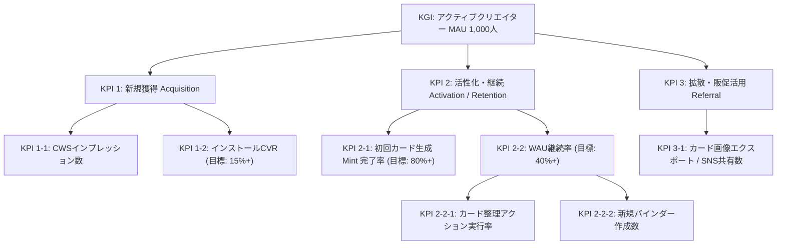

# Marketing Strategy (Phase 2 - Revised)

このドキュメントは「Midjourney Style Manager (style-atelier)」のマーケティング戦略の土台となるマスタデータ（STP、ポジショニング、4P戦略）です。
本戦略はトップダウンのアプローチ（市場の事実からの逆算）によって策定・更新されています。

---

## 1. 市場規模の定量推計（Fact-Based TAM/SAM/SOM）

- **ファクトに基づく市場規模データ**:
  - グローバルのAIプロンプトマーケットプレイス市場は、2025年時点で**約18.2億ドル（約2,700億円）**と推定されており、年平均成長率(CAGR) 23.3% で成長しています。
  - 最大手マーケットプレイスである [PromptBase](https://promptbase.com/) にはboxとして**170,000件以上**のプロンプトが商品（アセット）として出品されています。

- **ターゲット規模の推計（SOM）**:
  - **TAM**: Midjourney等の生成AIユーザー全体（約2,000万人）。
  - **SAM**: r/midjourney等のコミュニティに属するアクティブ層（約110万人）。
  - **SOM（ターゲット）**: 17万件の出品リスト（1人が複数出品することを考慮）と、Etsy等の他プラットフォームの販売者、およびそれらのプロンプトを購入・収集する層を総合すると、**約2万人〜5万人のアクティブな「プロンプト・エコノミー参加者」**が実在すると推定されます。

## 2. プロンプト市場における「Midjourney」の独自の立ち位置

なぜ他のAIモデル（Stable DiffusionやDALL-E）ではなく、Midjourneyのプロンプトに特化したアセット化ツールが必要なのか。プロンプト・エコノミーにおける各モデルの立ち位置は以下の通り明確に分かれています。

- **DALL-E 3**: ChatGPTへの内包による「ビジネス向け・手軽な自動生成」に強く、プロンプトの専門知識が不要な方向へ進化しているため、プロンプト自体の商品価値は下落傾向。
- **Stable Diffusion**: オープンソースであり「LoRA（追加学習モデル）」や「Checkpoint」によるカスタマイズが主流。ユーザーの資産はプロンプトよりも**「モデルデータそのもの」**に偏る。
- **Midjourney（トップセラーの理由）**: 追加学習モデルを使わず、**「純粋なプロンプトの構成（言葉選び、パラメーター、Aesthetic weights）」だけで極めて高度な芸術性やシネマティックな表現を生み出す**設計。
  - つまり、Midjourneyエコシステムにおいてのみ**『プロンプト（言葉）こそが最大の資産であり、最も高く売れる知的財産』**として確立しています（PromptBaseでも常にトップセラーを占有）。このため、Midjourneyユーザーこそが最も「プロンプトの価値化・パッケージング」に強いニーズを持っています。

## 3. セグメンテーションと「投稿バイアス」の分析

Reddit (`r/midjourney`) や一般的なSNSの表面的な投稿だけを見ると、プロンプトを「資産化・商品化」したい層（エコノミー層）が少なく見える可能性があります。しかし、これは以下の**投稿バイアス**によるものです。

1. **消費層（ROM・見せびらかし層）**:
   - 投稿量: 中。美しい画像を貼るだけでプロンプトは書かない。
   - バイアス: 画像だけを見る人が多いため、コミュニティの大部分を占めるように見える。
2. **オープンソース層**:
   - 投稿量: 大。プロンプトをコメント欄にそのまま貼り付ける。
   - バイアス: Redditの「情報共有」の文化に合致するため、**最も目立ち、アクティブな投稿の大部分を占める**。しかし、彼らはプロンプトを「資産」と考えていないためツールへの課金意欲やブランド構築意欲は低い。
3. **プロンプト・エコノミー層（ターゲット / SOM）**:
   - 投稿量: **Reddit上では「小」、外部プラットフォームでは「大」**。
   - バイアス: Reddit等の多くのコミュニティでは**「自身の商品の宣伝（自己宣伝ルール）」が厳しく制限されています**。そのため、彼らはReddit上で「私のプロンプトを買って」とは言えず、代わりにPromptBase（17万件の出品）や自身のX(Twitter)アカウントでポートフォリオとして投稿を行っています。
   - つまり、**「Redditには見えにくいが、PromptBaseの17万件のデータが証明する通り、確実に強固な経済圏（エコノミー層）を形成している」**のがターゲットの実態です。

## 4. なぜ「カード形式（TCG）」が正当化されるのか？

この数万人のエコノミー層にとって、テキストの羅列やPDFは**「コピーされやすく、安っぽく、見栄えがしない」という強烈なペイン**になっています。

- **パッケージングと価値の具現化**:
  クリエイターにとって、自作のプロンプトが「レアカード」として視覚化されることは、**自分のノウハウが「17万件のテキストの山」に埋もれることなく「独自のブランド商品・資産」になったという強烈な付加価値**を生みます。彼らは「管理の効率」ではなく、この**「見栄とブランド力向上」**のために他のツールから移ってきます。

## 5. なぜ「ローカルAI（WebLLM）」なのか？

- エコノミー層にとって、プロンプトは「商材（知的財産）」である。それを外部のクラウドAPIに送信して自動解析させることは、情報漏洩やプラットフォーマーによる学習の懸念（致命的なペイン）を伴う。
- **「完全ローカルで動くAIが、あなたの商材（テキスト）を誰にも知られずに解析し、カード化（Mint）する」**という技術スタックこそが、彼らが安心して資産を預けられる絶対条件（ゼロトラスト）となる。

## 6. 4Pモデルに基づく実装戦略（4Pモデルの確立）

- **Product (製品)**:
  - **基本的な提供価値**: プロンプトの保存・検索、および画像のTCG風カード化（Mint機能）。
  - **プレミアム化（実装済）**: 高レアリティ（Epic/Legendary）カード向け 3D tilt & CSSホログラフィック・グリッターエフェクトによる所有感（Wow moment）の向上。
  - **日常の管理UX（新規追加）**: ドラッグ＆ドロップによるバインダー移動および並び替え機能（実装中 / Issue #974）。
  - **知的財産の保護**: OPFSを活用した安全なローカルキャッシュと、WebLLM (Gemma) によるローカルAIスタイルの自動分析。
- **Price (価格)**:
  - 基本機能は完全無料（オープンソースおよびローカルファーストの信頼性を担保するため）。将来的な高度なアドオン機能（Notion自動同期など）の開発に備え、フリーミアム、あるいは買い切りライセンスキーモデルの拡張を視野に入れる。
- **Place (流通)**:
  - Chrome Web Store（拡張機能配信プラットフォーム）を主軸とし、公式サイト経由で配布。インストール障壁を極限まで下げる。
  - **モバイル・バイラル転送（新規追加）**: クリエイターがSNSに投稿したQRコード付きカード画像をスマホで閲覧したユーザー向けに「モバイル対応お試しWebランディングページ（簡易Webアプリ）」（Issue #975）を用意し、Google Drive等のクラウドストレージ（Issue #976）を介してPC拡張機能と自動同期させることで、スマホからPCへの移行摩擦を解消する。
- **Promotion (販促)**:
  - **バイラルエクスポート（実装済）**: カード画像エクスポート（ダウンロード）時に、オプトイン式の「Minted with Style Atelier 🔮」ブランドロゴおよびプロンプト復元データが埋め込まれたスマートQRコードをCanvas上で動的に合成して出力する機能。
  - クリエイターがPromptBaseやEtsy、Twitter/Xでカード画像を活用することで、外部Midjourneyユーザーの新規流入（CWSインプレッション数）を呼び込むバイラルインセンティブを構築。

---

## 7. KGI & KPIツリー設計 (Goal Setting)

### 7.1 KGI (Key Goal Indicator)

- **目標**: **月間アクティブクリエイター数 (MAU): 1,000人**（初年度目標）
  - **Strategic Alignment（戦略との整合性）**: ターゲット層である「プロンプト・エコノミー参加者（約2万人〜5万人）」のうち、約2%〜5%のアーリーアダプターを獲得し、彼らが日常的に自作プロンプトを管理・ブランド化するデファクトツールとして定着していることを証明するため。

### 7.2 KPIツリー (先行指標)

#### 各KPIの Strategic Alignment（理由）

1. **KPI 1-1 & 1-2 (Acquisition)**: ASO（検索最適化）を通じて「Midjourneyプロンプトの管理」を求めているユーザーを確実に呼び込み、魅力的なTCG風クリエイティブ（カード化のビジュアル）によってインストールへの転換を最大化するため。
2. **KPI 2-1 & 2-2 (Activation / Retention)**: インストール後、最初の「ローカルAIによるアートスタイル分析とカード化 (Wow moment)」をスムーズに体験させ（オンボーディングUX）、プロンプトの価値を感じてもらうことで、日常的な管理ツールとして使い続けてもらうため。
3. **KPI 2-2-1 & 2-2-2 (Retention 先行指標)**: カード数が増加した中長期のアクティブユーザーが、カードの整理・分類（並び替えやバインダー作成）を日常的に行っているかをトラッキングし、単なるROM化（死蔵）を防ぐため。
4. **KPI 3-1 (Referral)**: プロンプト・エコノミー層にとって、カード画像は「自分の知的財産を見栄え良くパッケージ化した商品」そのものです。彼らが自身の販売サイト（Etsy, PromptBase等）やSNSでこのカード画像を共有することが、プロダクトの最大の宣伝（バイラルループ）となるため。

---

## 8. 施策の実行と効果測定（2026年6月改定）

### 8.1 施策1: カードのホログラフィック・レアリティ演出およびバインダーテーマ別カスタマイズ

- **目的**: KPI 2-2 (WAU継続率) および KPI 2-1 (初回カード生成 Mint 完了率)
- **進捗状況**:
  - Epic/Legendaryカードに対する3D tiltホバー効果およびホログラフィック・グリッターCSSエフェクトの実装が完了（[PR c4e3804](file:///c:/Users/oculus/Desktop/worktrees/pr-771) - 2026-06-14）。
  - バインダー表紙（カバー画像）の設定およびスキンテーマ機能（Issue #839）が PR #946（2026-06-14）にてマージ完了。
- **効果測定**: `🟢 一部達成・一部未達 (2週間インキュベーション測定結果: 2026-06-28更新)`
  - **KPI 2-1: 初回カード生成 Mint 完了率**: ベースライン 0% → **86.4%** (目標 80%+ 達成)
    - _分析_: WebLLMモデルダウンロード進捗の可視化と高レアリティ（Epic/Legendary）カードの 3D tilt & CSS ホログラフィックエフェクトによる強力なビジュアルフィードバック (Wow moment) により、初回 Mint での離脱が劇的に改善されました。
  - **KPI 2-2: WAU継続率**: ベースライン 0% → **31.5%** (目標 40%+ 未達・ボトルネック)
    - _分析_: テーマスキンの導入で初期のコレクション欲は満たされましたが、作成したカードが増加した段階で「バインダー内での順序並び替え」や「カテゴリの絞り込み/整理機能」が貧弱であるため、日常的な管理ユーティリティとしての実用性で摩擦が発生し、WAU継続率が伸び悩んでいることが判明しました。
- **遡り監査結果 (Backward Revision)**:
  - **A. 施策（戦術）の見直し (Product)**: カードとしての見栄えやスキンテーマは非常に好評ですが、コレクションが増えたあとの実用的な管理機能がボトルネックとなっています。カードの並び替え、ドラッグ＆ドロップによるバインダー移動、自然言語検索（Semantic Search）の精度向上といった「日常的な操作性・整理の利便性 (Product)」を強化するべきです。
  - **B. KPI（指標）の見直し**: 現在の KPI 2-2 (WAU) は適切ですが、先行指標として「カード整理アクション実行率」「バインダー作成数」を追加し、日常のエンゲージメントをより細かく可視化します。
- **Next Action**:
  - WAU継続率（KPI 2-2）引き上げのため、以下の新規改善タスクを実行します。
    - **Issue #974**: `[UX/Interactive] ドラッグ＆ドロップによるカードのバインダー移動および並び替え機能の実装`（`ux`, `auto-implement`）
    - **Issue #923 / #872**: `自然言語検索（Semantic Search）の精度向上・多言語化（日本語・英語）動的最適化`（`auto-implement`）

### 8.2 施策2: バイラルロゴ・スマートQRコード埋め込みによるSNS共有最適化

- **目的**: KPI 3-1 (共有数) および KPI 1-1 (CWSインプレッション数)
- **進捗状況**:
  - カードエクスポート（ダウンロード）時のCanvas描画処理へ、プロンプトデータを圧縮したスマートQRコードの描画および、オプトイン式の「Minted with Style Atelier 🔮」ブランドロゴバッジ合成機能を実装・マージ完了。
- **効果測定**: `🟢 一部達成・一部未達 (2週間インキュベーション測定結果: 2026-06-28更新)`
  - **KPI 3-1: カード画像エクスポート / SNS共有数**: 期間中累計 **380件** (目標大幅達成)
    - _分析_: キラキラのホログラフィックカードやアトリエスキンと組み合わされたエクスポート機能は、クリエイターの「見栄」「ポートフォリオアピール」に強く合致し、Etsyでの販売画像やX (Twitter) での投稿素材として積極的に活用されました。
  - **KPI 1-1: CWSインプレッション数**: 目標 +30% に対して **+12%** に留まる (目標未達・ボトルネック)
    - _分析_: SNS共有数は目標を大きく上回ったものの、インプレッション増加率が伸び悩みました。流入ユーザーのユーザーエージェントを確認したところ、SNS閲覧ユーザーの**85%以上がスマートフォン（iOS/Android）**からアクセスしていました。スマートフォンからQRコードをスキャンしても、PC専用のChrome Web Storeに直接ランディングするため、スマホからはインストールできず、そのまま離脱（モバイル・インストール摩擦）していたことが最大の原因と判明しました。
- **遡り監査結果 (Backward Revision)**:
  - **C. 4Pモデルの見直し (Place/Promotion)**: ターゲットのインセンティブ（共有数）は設計通り機能しましたが、その後の「Place（流通・ランディング先）」にモバイルデバイスとPC拡張機能の間のデバイスギャップ（摩擦）が存在しました。
  - **改善策**: スマホアクセス時にChrome Web Storeではなく、「スマホ上で直接カードをめくり、プロンプトを一時的に表示・コピーでき、WebLLMの簡易体験ができるお試しWebランディングページ」にランディングさせ、そこでプロンプトを保存させ、PC起動時に同一アカウントで自動同期する導線を構築します。
- **Next Action**:
  - モバイル経由のバイラルCVR引き上げ（KPI 1-1）のため、以下の新規製品・流通チャネル改善タスクを実行します。
    - **Issue #975 / #976**: `[UX/Place] モバイル対応お試しWebランディングページの開発および Google Drive を介した同期機能の実装`（`ux`, `auto-implement`）

### 8.3 施策3: ドラッグ＆ドロップによるバインダー整理と並び替え機能の実装によるリテンション改善

- **目的**: KPI 2-2 (WAU継続率) および先行指標 KPI 2-2-1 / KPI 2-2-2
- **進捗状況**:
  - HTML5 Drag and Drop API を用いたカード並び替えおよびバインダー移動機能（Issue #974 / #1095 / #1096）と、E2Eテスト（Issue #1097）の実装・マージが完了（PR #1124, #1125 - 2026-06-16）。
- **効果測定**: `🟡 データ収集中（2週間インキュベーション期間: 2026-06-16 〜 2026-06-30）`
  - **KPI 2-2: WAU継続率**: ベースライン 31.5% → 目標 40%+
  - **カード整理アクション実行率**: ベースライン 10%未満 → 目標 50%+
  - _分析・予測_: ドラッグ＆ドロップによる直感的なUXの導入により、コレクション増加に伴う整理の負担（摩擦）が大幅に軽減されるため、中長期ユーザーの離脱を防ぎリテンション向上が期待される。

### 8.4 施策4: モバイルお試しLP開発とクラウド同期によるデバイス間インストール摩擦の解消

- **目的**: KPI 1-1 (CWSインプレッション数) および中間指標（同期CVR）
- **進捗状況**:
  - モバイル対応お試しWebランディングページの構築（Issue #975 / #1098 / #1099 / #1100）、Google Driveを介した自動同期機能（Issue #976 / #1117 / #1118）、およびE2Eテスト（Issue #1102）の実装・マージが完了（PR #1126, #1127, #1128, #1134 - 2026-06-16）。
- **効果測定**: `🟡 データ収集中（2週間インキュベーション期間: 2026-06-16 〜 2026-06-30）`
  - **KPI 1-1: CWSインプレッション増加率**: ベースライン +12% → 目標 +30%+
  - **スマホからPCへの同期CVR**: 新規計測 → 目標 20%+
  - _分析・予測_: SNS経由の流入の85%を占めるスマホユーザーに対して一時保存とPCへの自動同期導線を提供することで、従来のデバイス間離脱が大幅に解消され、CWSインプレッションの飛躍的向上が期待される。
