# ユーザージャーニー定義

※このドキュメントは `userJourneys.json` から自動生成されています。手動で編集しないでください。

## グローバルジャーニーマップ（画面遷移図）

各ユーザージャーニー間の遷移（ナビゲーション）関係を示します。

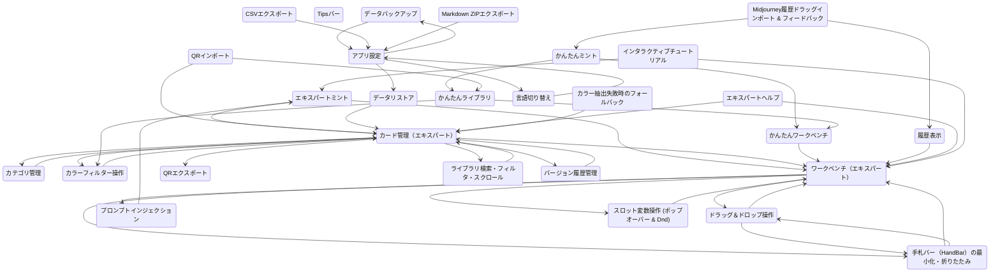

## 個別ジャーニーのフロー詳細

### @J-MINT-EXPERT-01: エキスパートミント

エキスパートモードで画像からスタイルカードを作成する

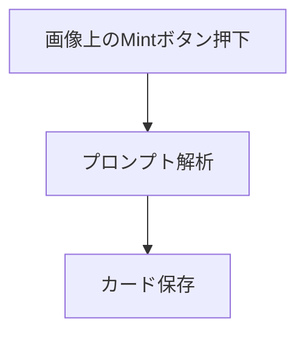

### @J-MINT-EASY-01: かんたんミント

かんたんモードで画像からスタイルカードを作成する

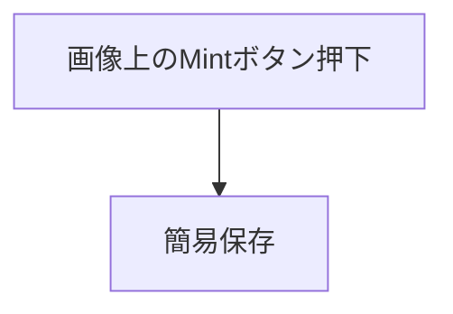

### @J-ORG-EXPERT-01: カード管理（エキスパート）

エキスパート向けカード管理（編集・削除）

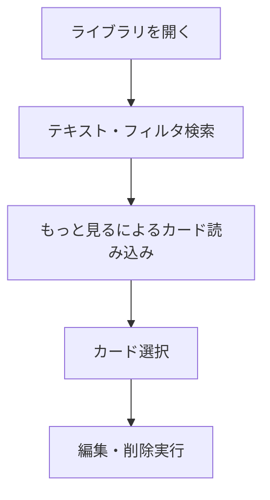

### @J-ORG-EXPERT-02: カテゴリ管理

カテゴリの作成と割り当て

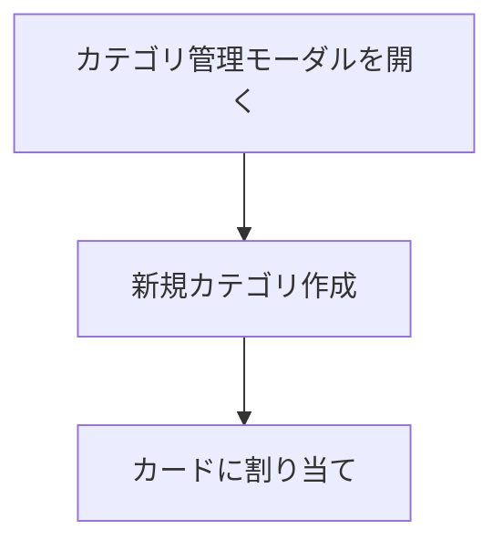

### @J-ORG-EASY-01: かんたんライブラリ

かんたんモードのライブラリ（カード閲覧・選択）

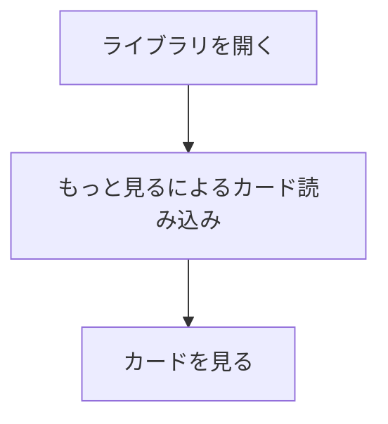

### @J-ORG-COLOR-FILTER-01: カラーフィルター操作

カラーパレットフィルターを横スクロール・選択してカードを絞り込む

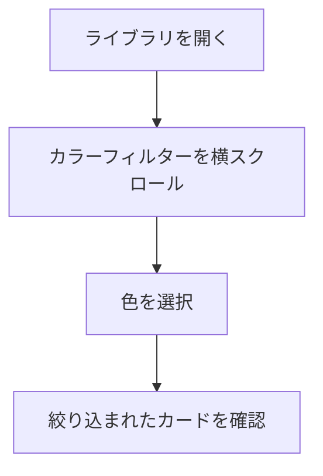

### @J-WB-EXPERT-01: ワークベンチ（エキスパート）

エキスパートモードでプロンプトを構築する

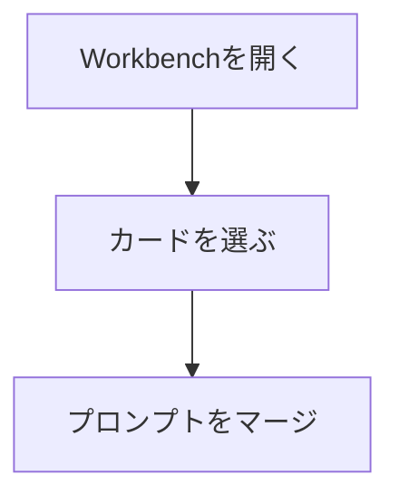

### @J-WB-EXPERT-02: ドラッグ＆ドロップ操作

ドラッグ＆ドロップでカードを配置する

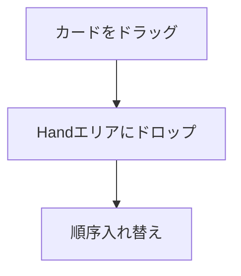

### @J-WB-EXPERT-03: プロンプトインジェクション

Midjourneyへのプロンプトインジェクション

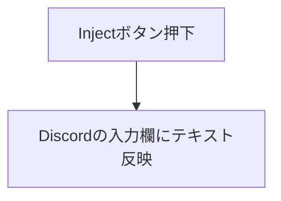

### @J-WB-EASY-01: かんたんワークベンチ

かんたんモードでプロンプトを合成する

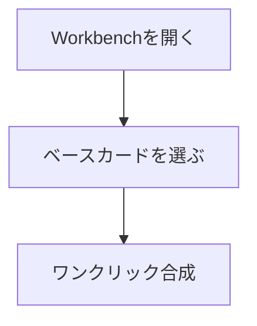

### @J-IO-QR-OUT: QRエクスポート

スタイルカードをQRコードとして出力する

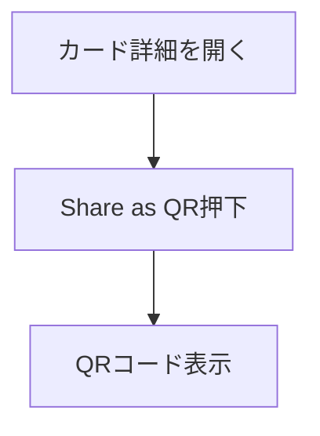

### @J-IO-QR-IN: QRインポート

QRコードを読み取ってカードをインポートする

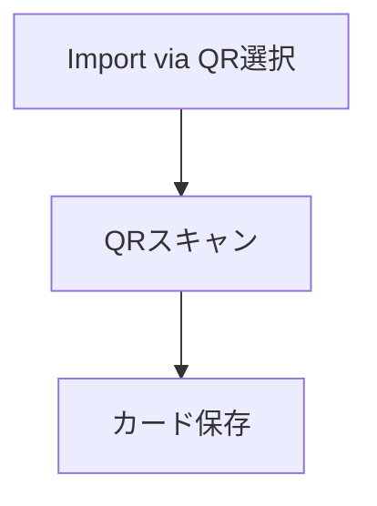

### @J-IO-BACKUP: データバックアップ

アプリケーションデータのバックアップエクスポート

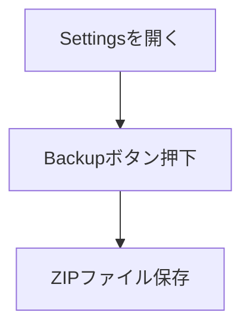

### @J-IO-RESTORE: データリストア

バックアップデータからのリストア

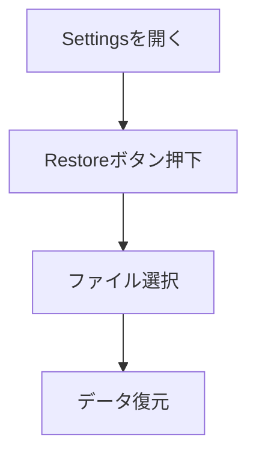

### @J-SYS-01: 履歴表示

履歴（History）の閲覧とスクロール

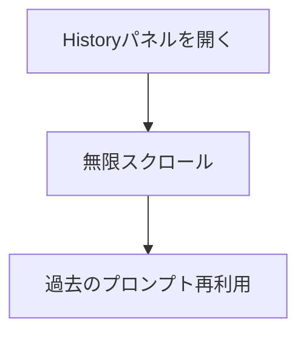

### @J-SYS-02: エキスパートヘルプ

エキスパート向けヘルプツールチップの確認

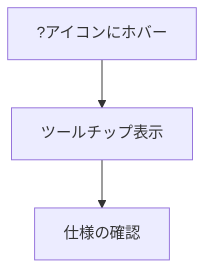

### @J-SYS-03: Tipsバー

使い方Tipsバー of 操作

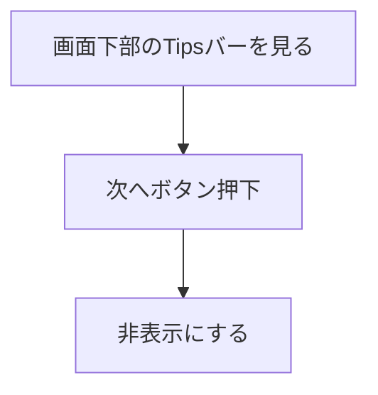

### @J-SYS-04: 言語切り替え

多言語（i18n）切り替えと表示

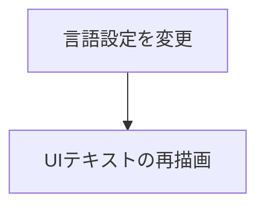

### @J-SET-01: アプリ設定

アプリケーション設定の変更

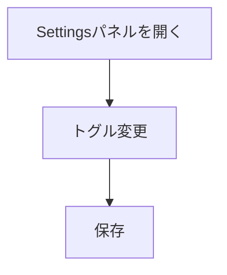

### @J-WB-EXPERT-04: スロット変数操作 (ポップオーバー & Dnd)

スロット変数エリアでのサジェスト選択およびカードのドラッグ＆ドロップ適用

```mermaid
flowchart TD
  S1["スロット入力フィールドフォーカス"]
  S2["ポップオーバーサジェスト選択"]
  S1 --> S2
  S3["カードをスロットにドラッグ＆ドロップ"]
  S2 --> S3
```

### @J-ORG-SEARCH-01: ライブラリ検索・フィルタ・スクロール

FlexSearchを用いた高速検索およびカラーフィルタの横スクロール操作

```mermaid
flowchart TD
  S1["ライブラリを開く"]
  S2["検索フィールドにキーワード入力"]
  S1 --> S2
  S3["カラーパレットフィルタを横スクロールで確認"]
  S2 --> S3
  S4["カラーフィルタをクリックして絞り込み"]
  S3 --> S4
  S5["「もっと読み込む」ボタンをクリックして追加表示"]
  S4 --> S5
```

### @J-WB-EXPERT-05: 手札バー（HandBar）の最小化・折りたたみ

画面の表示領域を確保するために手札バーを最小化し、必要に応じて展開する

```mermaid
flowchart TD
  S1["最小化ボタン押下"]
  S2["手札バーが折りたたまれる"]
  S1 --> S2
  S3["展開ボタン押下（または新規カード追加で自動展開）"]
  S2 --> S3
  S4["手札バーが再展開される"]
  S3 --> S4
```

### @J-TUTORIAL-01: インタラクティブチュートリアル

新規ユーザー向けのインタラクティブチュートリアル（オンボーディング）の実行

```mermaid
flowchart TD
  S1["「チュートリアルを開始する」ボタン押下"]
  S2["ステップ進行（ドラッグ＆ドロップ、Mintボタンクリック、保存など）"]
  S1 --> S2
  S3["チュートリアル完了"]
  S2 --> S3
```

### @J-IO-MJ-DRAG-IN: Midjourney履歴ドラッグインポート & フィードバック

Midjourneyから生成履歴や画像をドラッグ＆ドロップしてインポートする（ドラッグ時の視覚的フィードバック付）

```mermaid
flowchart TD
  S1["Midjourney画像をドラッグ"]
  S2["サイドパネル上にオーバーレイ（インディゴ/ブルー）が表示されることを確認"]
  S1 --> S2
  S3["ドロップして履歴追加または簡易カード作成（Easy Mode）が開始されることを確認"]
  S2 --> S3
```

### @J-MINT-COLOR-FALLBACK: カラー抽出失敗時のフォールバック

画像のカラー抽出が失敗した場合にレア度に応じたテーマカラーが自動設定され、レア度変更時に動的に切り替わることを確認してミントする

```mermaid
flowchart TD
  S1["Mint画面を開く"]
  S2["カラー抽出が失敗した状態でレア度Commonに対応するフォールバックカラーが適用されているのを確認"]
  S1 --> S2
  S3["レア度を切り替えて対応するテーマカラーに動的に変更されるのを確認"]
  S2 --> S3
  S4["カード保存"]
  S3 --> S4
```

### @J-ORG-VERSION-01: バージョン履歴管理

スタイルカード詳細画面で過去のプロンプト・パラメータ変更履歴を確認し、任意のバージョンにロールバックする

```mermaid
flowchart TD
  S1["カード詳細を開く"]
  S2["変更履歴リストを表示"]
  S1 --> S2
  S3["任意のバージョンで復元を選択"]
  S2 --> S3
  S4["フォーム上で復元された値を確認"]
  S3 --> S4
  S5["保存して確定"]
  S4 --> S5
```

### @J-IO-CSV: CSVエクスポート

外部連携用のCSV形式でスタイルカードデータをエクスポートする

```mermaid
flowchart TD
  S1["Settingsを開く"]
  S2["Export CSVボタン押下"]
  S1 --> S2
  S3["CSVファイル保存"]
  S2 --> S3
```

### @J-IO-MD: Markdown ZIPエクスポート

外部連携用（Notion/Obsidian等）のMarkdownファイル群をZIP形式でエクスポートする

```mermaid
flowchart TD
  S1["Settingsを開く"]
  S2["Export Markdownボタン押下"]
  S1 --> S2
  S3["ZIPファイル保存"]
  S2 --> S3
```
