# ユーザージャーニー定義

※このドキュメントは `userJourneys.json` から自動生成されています。手動で編集しないでください。

## グローバルジャーニーマップ（画面遷移図）

各ユーザージャーニー間の遷移（ナビゲーション）関係を示します。

```mermaid
stateDiagram-v2
  _J_MINT_EXPERT_01 : エキスパートミント
  _J_MINT_EASY_01 : かんたんミント
  _J_ORG_EXPERT_01 : カード管理（エキスパート）
  _J_ORG_EXPERT_02 : カテゴリ管理
  _J_ORG_EASY_01 : かんたんライブラリ
  _J_ORG_COLOR_FILTER_01 : カラーフィルター操作
  _J_WB_EXPERT_01 : ワークベンチ（エキスパート）
  _J_WB_EXPERT_02 : ドラッグ＆ドロップ操作
  _J_WB_EXPERT_03 : プロンプトインジェクション
  _J_WB_EASY_01 : かんたんワークベンチ
  _J_IO_QR_OUT : QRエクスポート
  _J_IO_QR_IN : QRインポート
  _J_IO_BACKUP : データバックアップ
  _J_IO_RESTORE : データリストア
  _J_SYS_01 : 履歴表示
  _J_SYS_02 : エキスパートヘルプ
  _J_SYS_03 : Tipsバー
  _J_SYS_04 : 言語切り替え
  _J_SET_01 : アプリ設定
  _J_WB_EXPERT_04 : スロット変数操作 (ポップオーバー & Dnd)
  _J_ORG_SEARCH_01 : ライブラリ検索・フィルタ・スクロール
  _J_WB_EXPERT_05 : 手札バー（HandBar）の最小化・折りたたみとスクロール
  _J_TUTORIAL_01 : インタラクティブチュートリアル
  _J_IO_MJ_DRAG_IN : Midjourney履歴ドラッグインポート & フィードバック
  _J_MINT_COLOR_FALLBACK : カラー抽出失敗時のフォールバック
  _J_ORG_VERSION_01 : バージョン履歴管理
  _J_WB_MIXING_WEIGHTS_01 : 調合割合ウェイト調整
  _J_WB_PORTION_EXTRACT_01 : 成分抽出とブレンド
  _J_IO_CSV : CSVエクスポート
  _J_IO_MD : Markdown ZIPエクスポート
  _J_WB_ATELIER_EFFECTS_01 : アトリエ釜と錬金演出
  _J_ORG_FOLDER_01 : フォルダ階層化管理（ドリルダウン・DnD移動）
  _J_ORGAN_UX_PARAM_01 : パラメータエイリアス・ガチャPick（無機質なパラメータの視覚化とセレンディピティ）
  _J_WB_MIXING_INTELLIGENT_01 : Midjourney sref/cref インテリジェントブレンド
  _J_ORG_QUICK_SEND_01 : クイックワークベンチ送信
  _J_ORG_SEMANTIC_SEARCH_01 : セマンティック検索による自然言語フィルターリング
  _J_WB_AI_ADVICE_01 : AI調合アドバイス表示
  _J_ORG_CARD_TOOLTIP_01 : カードアクションツールチップ＆レスポンシブメニュー
  _J_WB_EMPTY_CAULDRON_01 : 空状態の大釜アフォーダンス
  _J_UX_RESILIENCE_01 : 狭小画面ビジュアルレジリエンス
  _J_UX_NON_TARGET_01 : 非対象サイトでの機能制限緩和
  _J_ORG_CARD_HOLO_EFFECT_01 : 高レアリティカードプレミアムエフェクト
  _J_AI_DECLUTTER_01 : AIプロンプトクリーンアップ（整理・分割）
  _J_AI_DECLUTTER_02 : AIプロンプトクリーンアップ軽量フォールバック
  _J_ORG_BINDER_CUSTOMIZE_01 : バインダーのカスタマイズ（カバー画像とテーマ設定）
  _J_SET_WEBGPU_TROUBLESHOOT_01 : WebGPUトラブルシューティング・自動フォールバックと容量チェック
  _J_WB_UNDO_REDO_01 : ワークベンチ操作の履歴管理（Undo/Redo）
  _J_UX_DISCONNECTED_ALERT : 接続切断時のエラーハンドリングとリカバリ
  _J_MOBILE_PREVIEW_01 : モバイルお試しプレビュー＆フリップ
  _J_ORG_BINDER_DND_01 : カードのバインダーDnD移動
  _J_SET_GDRIVE_ERROR : Google Drive同期エラーハンドリング
  _J_PROFILER_DASHBOARD : 開発者プロファイラーダッシュボード
  _J_SANDBOX_CONTROLLER_01 : サンドボックスコントローラーによる異常系シミュレーション
  _J_PWA_A2HS_OFFLINE_01 : モバイルPWAスマートQR起動＆A2HSとオフライン閲覧
  _J_PWA_P2P_SYNC_01 : モバイルPWA・PC間ハイブリッド同期（P2P/Drive）
  _J_PWA_AI_STYLE_ANALYSIS_01 : モバイルPWAローカルAIアートスタイル分析
  _J_MINT_EXPERT_01 --> _J_ORG_EXPERT_01
  _J_MINT_EXPERT_01 --> _J_WB_EXPERT_01
  _J_MINT_EASY_01 --> _J_ORG_EASY_01
  _J_MINT_EASY_01 --> _J_WB_EASY_01
  _J_ORG_EXPERT_01 --> _J_ORG_EXPERT_02
  _J_ORG_EXPERT_01 --> _J_WB_EXPERT_01
  _J_ORG_EXPERT_01 --> _J_IO_QR_OUT
  _J_ORG_EXPERT_01 --> _J_ORG_COLOR_FILTER_01
  _J_ORG_EXPERT_01 --> _J_ORG_SEARCH_01
  _J_ORG_EXPERT_01 --> _J_ORG_VERSION_01
  _J_ORG_EXPERT_01 --> _J_ORG_FOLDER_01
  _J_ORG_EXPERT_01 --> _J_ORG_QUICK_SEND_01
  _J_ORG_EXPERT_01 --> _J_ORG_CARD_HOLO_EFFECT_01
  _J_ORG_EXPERT_01 --> _J_ORG_BINDER_DND_01
  _J_ORG_EXPERT_02 --> _J_ORG_EXPERT_01
  _J_ORG_EXPERT_02 --> _J_ORG_FOLDER_01
  _J_ORG_EASY_01 --> _J_WB_EASY_01
  _J_ORG_EASY_01 --> _J_ORG_COLOR_FILTER_01
  _J_ORG_EASY_01 --> _J_ORG_QUICK_SEND_01
  _J_ORG_COLOR_FILTER_01 --> _J_ORG_EXPERT_01
  _J_WB_EXPERT_01 --> _J_WB_EXPERT_02
  _J_WB_EXPERT_01 --> _J_WB_EXPERT_03
  _J_WB_EXPERT_01 --> _J_WB_EXPERT_04
  _J_WB_EXPERT_01 --> _J_WB_EXPERT_05
  _J_WB_EXPERT_01 --> _J_WB_EMPTY_CAULDRON_01
  _J_WB_EXPERT_02 --> _J_WB_EXPERT_01
  _J_WB_EXPERT_02 --> _J_WB_EXPERT_05
  _J_WB_EXPERT_02 --> _J_WB_MIXING_WEIGHTS_01
  _J_WB_EXPERT_02 --> _J_WB_PORTION_EXTRACT_01
  _J_WB_EXPERT_02 --> _J_WB_ATELIER_EFFECTS_01
  _J_WB_EXPERT_02 --> _J_WB_MIXING_INTELLIGENT_01
  _J_WB_EXPERT_02 --> _J_WB_AI_ADVICE_01
  _J_WB_EXPERT_03 --> _J_MINT_EXPERT_01
  _J_WB_EXPERT_03 --> _J_UX_DISCONNECTED_ALERT
  _J_WB_EASY_01 --> _J_WB_EXPERT_01
  _J_IO_QR_IN --> _J_ORG_EXPERT_01
  _J_IO_QR_IN --> _J_ORG_EASY_01
  _J_IO_BACKUP --> _J_SET_01
  _J_IO_RESTORE --> _J_ORG_EXPERT_01
  _J_SYS_01 --> _J_WB_EXPERT_01
  _J_SYS_02 --> _J_WB_EXPERT_01
  _J_SYS_02 --> _J_ORG_EXPERT_01
  _J_SYS_04 --> _J_SET_01
  _J_SET_01 --> _J_IO_BACKUP
  _J_SET_01 --> _J_IO_RESTORE
  _J_SET_01 --> _J_SYS_04
  _J_WB_EXPERT_04 --> _J_WB_EXPERT_01
  _J_ORG_SEARCH_01 --> _J_ORG_EXPERT_01
  _J_ORG_SEARCH_01 --> _J_ORG_SEMANTIC_SEARCH_01
  _J_WB_EXPERT_05 --> _J_WB_EXPERT_01
  _J_WB_EXPERT_05 --> _J_WB_EXPERT_02
  _J_TUTORIAL_01 --> _J_MINT_EXPERT_01
  _J_TUTORIAL_01 --> _J_WB_EXPERT_01
  _J_IO_MJ_DRAG_IN --> _J_SYS_01
  _J_IO_MJ_DRAG_IN --> _J_MINT_EASY_01
  _J_MINT_COLOR_FALLBACK --> _J_ORG_EXPERT_01
  _J_ORG_VERSION_01 --> _J_ORG_EXPERT_01
  _J_WB_MIXING_WEIGHTS_01 --> _J_WB_EXPERT_03
  _J_WB_PORTION_EXTRACT_01 --> _J_WB_EXPERT_01
  _J_IO_CSV --> _J_SET_01
  _J_IO_MD --> _J_SET_01
  _J_WB_ATELIER_EFFECTS_01 --> _J_WB_EXPERT_01
  _J_ORG_FOLDER_01 --> _J_ORG_EXPERT_01
  _J_ORGAN_UX_PARAM_01 --> _J_WB_EXPERT_01
  _J_ORGAN_UX_PARAM_01 --> _J_ORG_EXPERT_01
  _J_WB_MIXING_INTELLIGENT_01 --> _J_WB_EXPERT_03
  _J_ORG_QUICK_SEND_01 --> _J_WB_EXPERT_01
  _J_ORG_QUICK_SEND_01 --> _J_WB_EASY_01
  _J_ORG_SEMANTIC_SEARCH_01 --> _J_ORG_EXPERT_01
  _J_ORG_SEMANTIC_SEARCH_01 --> _J_ORG_SEARCH_01
  _J_WB_AI_ADVICE_01 --> _J_WB_EXPERT_01
  _J_WB_AI_ADVICE_01 --> _J_WB_EXPERT_03
  _J_ORG_CARD_TOOLTIP_01 --> _J_ORG_EXPERT_01
  _J_ORG_CARD_TOOLTIP_01 --> _J_ORG_QUICK_SEND_01
  _J_WB_EMPTY_CAULDRON_01 --> _J_WB_EXPERT_02
  _J_WB_EMPTY_CAULDRON_01 --> _J_WB_EXPERT_01
  _J_UX_RESILIENCE_01 --> _J_ORG_EXPERT_01
  _J_UX_RESILIENCE_01 --> _J_WB_EXPERT_01
  _J_UX_RESILIENCE_01 --> _J_SET_01
  _J_UX_NON_TARGET_01 --> _J_SET_01
  _J_UX_NON_TARGET_01 --> _J_ORG_EXPERT_01
  _J_UX_NON_TARGET_01 --> _J_ORG_EASY_01
  _J_ORG_CARD_HOLO_EFFECT_01 --> _J_ORG_EXPERT_01
  _J_AI_DECLUTTER_01 --> _J_MINT_EXPERT_01
  _J_AI_DECLUTTER_02 --> _J_MINT_EXPERT_01
  _J_ORG_BINDER_CUSTOMIZE_01 --> _J_ORG_EXPERT_01
  _J_SET_WEBGPU_TROUBLESHOOT_01 --> _J_SET_01
  _J_WB_UNDO_REDO_01 --> _J_WB_EXPERT_01
  _J_UX_DISCONNECTED_ALERT --> _J_ORG_EXPERT_01
  _J_UX_DISCONNECTED_ALERT --> _J_WB_EXPERT_01
  _J_ORG_BINDER_DND_01 --> _J_ORG_EXPERT_01
  _J_SET_GDRIVE_ERROR --> _J_SET_01
  _J_SANDBOX_CONTROLLER_01 --> _J_SET_WEBGPU_TROUBLESHOOT_01
  _J_PWA_A2HS_OFFLINE_01 --> _J_PWA_P2P_SYNC_01
  _J_PWA_P2P_SYNC_01 --> _J_MOBILE_PREVIEW_01
```

## 個別ジャーニーのフロー詳細

### @J-MINT-EXPERT-01: エキスパートミント

エキスパートモードで画像からスタイルカードをミントする

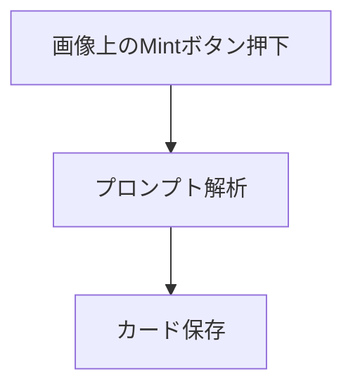

### @J-MINT-EASY-01: かんたんミント

かんたんモードで画像からスタイルカードをミントする

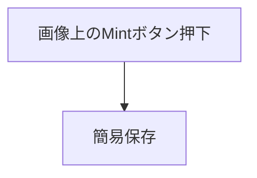

### @J-ORG-EXPERT-01: カード管理（エキスパート）

エキスパート向けカード管理（編集・削除）

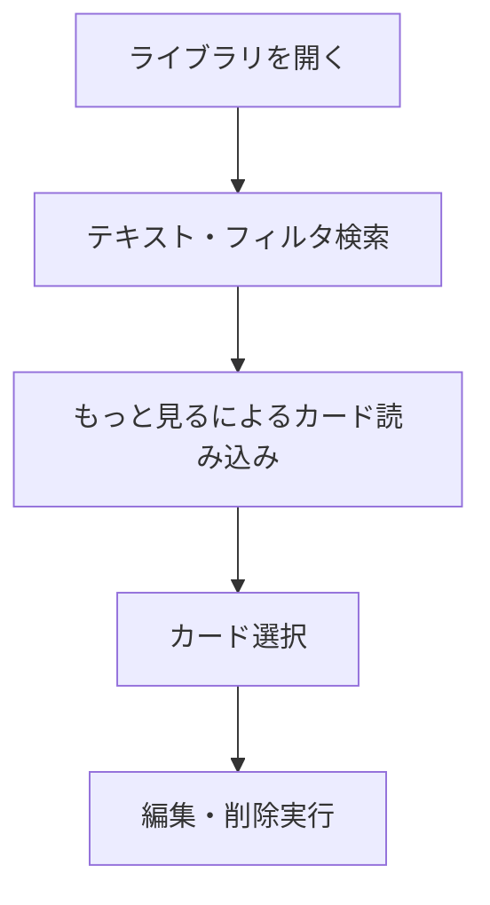

### @J-ORG-EXPERT-02: カテゴリ管理

カテゴリの作成と割り当て

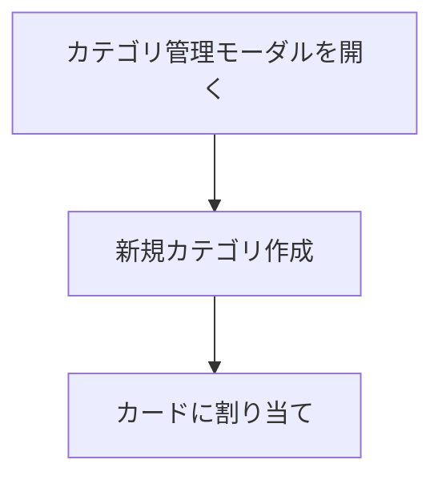

### @J-ORG-EASY-01: かんたんライブラリ

かんたんモードのライブラリ（カード閲覧・選択）

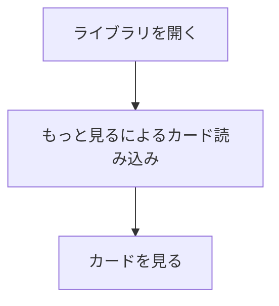

### @J-ORG-COLOR-FILTER-01: カラーフィルター操作

カラーパレットフィルターを横スクロール・選択してカードを絞り込む

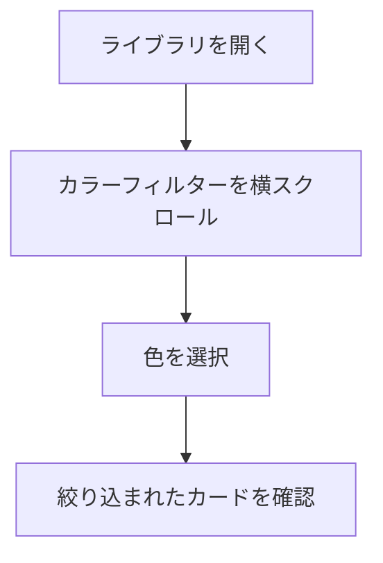

### @J-WB-EXPERT-01: ワークベンチ（エキスパート）

エキスパートモードでプロンプトを構築する

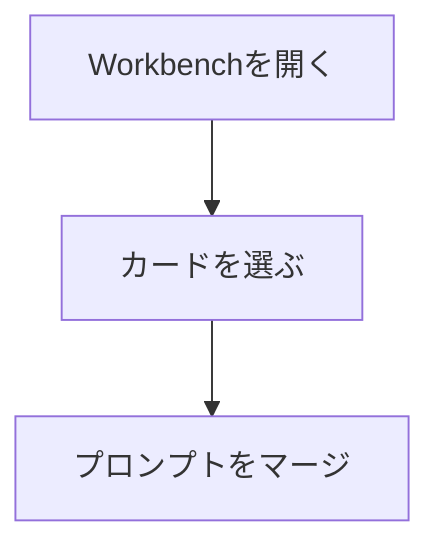

### @J-WB-EXPERT-02: ドラッグ＆ドロップ操作

ドラッグ＆ドロップでカードを配置する

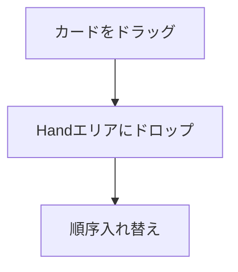

### @J-WB-EXPERT-03: プロンプトインジェクション

Midjourneyへのプロンプトインジェクション

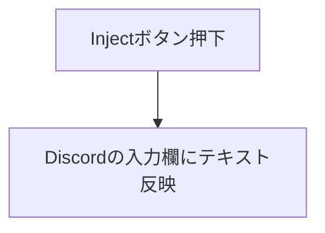

### @J-WB-EASY-01: かんたんワークベンチ

かんたんモードでプロンプトを合成する

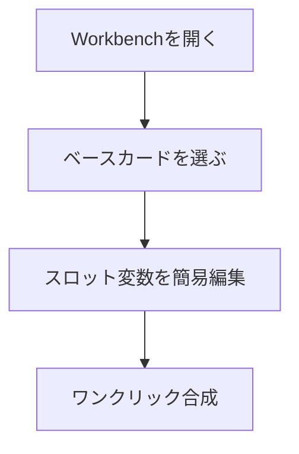

### @J-IO-QR-OUT: QRエクスポート

スタイルカードをQRコードとして出力する

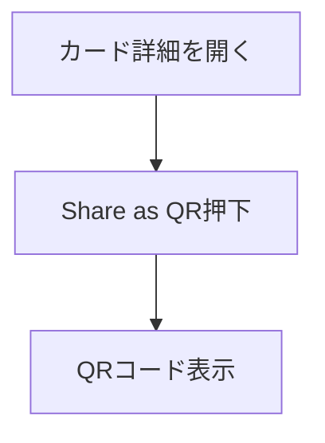

### @J-IO-QR-IN: QRインポート

QRコードを読み取ってカードをインポートする（巨大画像や破損画像に対するクラッシュ防止とエラーハンドリングを含む）

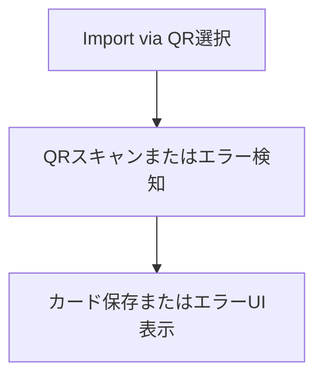

### @J-IO-BACKUP: データバックアップ

アプリケーションデータのバックアップエクスポート

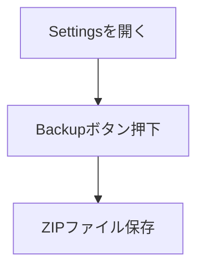

### @J-IO-RESTORE: データリストア

バックアップデータからのリストア

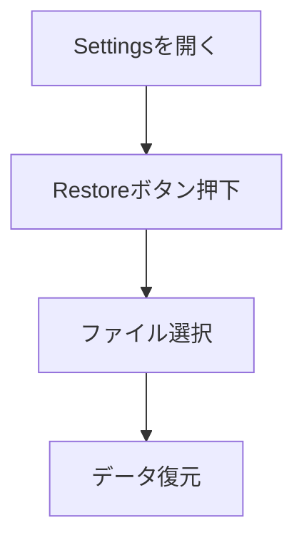

### @J-SYS-01: 履歴表示

履歴（History）の閲覧とスクロール

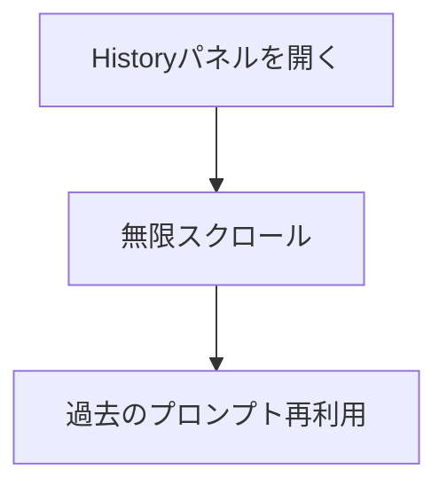

### @J-SYS-02: エキスパートヘルプ

エキスパート向けヘルプツールチップの確認

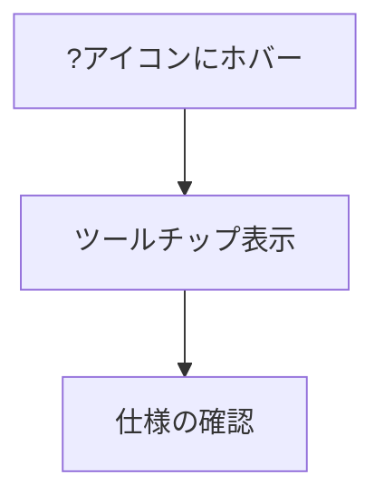

### @J-SYS-03: Tipsバー

使い方Tipsバー of 操作

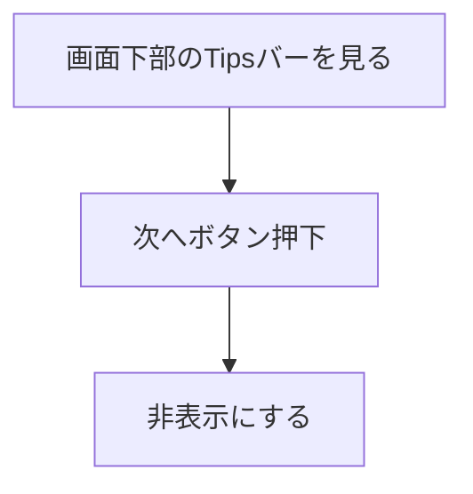

### @J-SYS-04: 言語切り替え

多言語（i18n）切り替えと表示

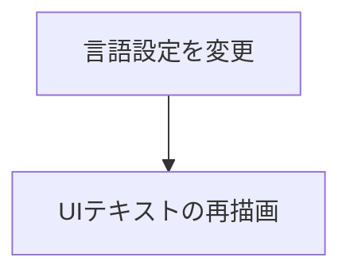

### @J-SET-01: アプリ設定

アプリケーション設定の変更

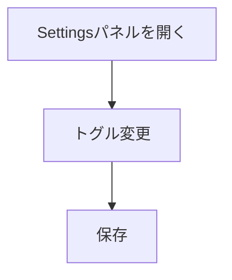

### @J-WB-EXPERT-04: スロット変数操作 (ポップオーバー & Dnd)

スロット変数エリアでのサジェスト選択およびカードのドラッグ＆ドロップ適用

```mermaid
flowchart TD
  S1["スロット入力フィールドフォーカス"]
  S2["ポップオーバーサジェスト選択"]
  S1 --> S2
  S3["カードをスロットにドラッグ＆ドロップ"]
  S2 --> S3
```

### @J-ORG-SEARCH-01: ライブラリ検索・フィルタ・スクロール

FlexSearchを用いた高速検索およびカラーフィルタの横スクロール操作

```mermaid
flowchart TD
  S1["ライブラリを開く"]
  S2["検索フィールドにキーワード入力"]
  S1 --> S2
  S3["カラーパレットフィルタを横スクロールで確認"]
  S2 --> S3
  S4["カラーフィルタをクリックして絞り込み"]
  S3 --> S4
  S5["「もっと読み込む」ボタンをクリックして追加表示"]
  S4 --> S5
```

### @J-WB-EXPERT-05: 手札バー（HandBar）の最小化・折りたたみとスクロール

手札バーを最小化して表示領域を確保し、多数 of カードがピン留めされた場合は縮小させずに、スタックUIとホバー時の浮き上がり、左右のフェードスクロールインジケータ、スクロールバーおよび左右ボタンで快適にスクロール操作する

```mermaid
flowchart TD
  S1["最小化ボタン押下"]
  S2["手札バーが折りたたまれる"]
  S1 --> S2
  S3["展開ボタン押下（または新規カード追加で自動展開）"]
  S2 --> S3
  S4["手札バーが再展開される"]
  S3 --> S4
  S5["多数のカードをピン留めする"]
  S4 --> S5
  S6["カードが縮小されずにスタックUIで配置され、横スクロール可能になることを確認する"]
  S5 --> S6
  S7["ホバー時にカードが浮き上がることを確認する"]
  S6 --> S7
  S8["左右のフェードオーバーレイと、うっすらと常時表示されるスクロールボタンまたはスクロールバーでカードリストをスクロールする"]
  S7 --> S8
```

### @J-TUTORIAL-01: インタラクティブチュートリアル

新規ユーザー向けのインタラクティブチュートリアル（オンボーディング）の実行

```mermaid
flowchart TD
  S1["「チュートリアルを開始する」ボタン押下"]
  S2["ステップ進行（ドラッグ＆ドロップ、Mintボタンクリック、保存など）"]
  S1 --> S2
  S3["チュートリアル完了"]
  S2 --> S3
```

### @J-IO-MJ-DRAG-IN: Midjourney履歴ドラッグインポート & フィードバック

Midjourneyから生成履歴や画像をドラッグ＆ドロップしてインポートする（ドラッグ時の視覚的フィードバック付）

```mermaid
flowchart TD
  S1["Midjourney画像をドラッグ"]
  S2["サイドパネル上にオーバーレイ（インディゴ/ブルー）が表示されることを確認"]
  S1 --> S2
  S3["ドロップして履歴追加または簡易カードミント（Easy Mode）が開始されることを確認"]
  S2 --> S3
```

### @J-MINT-COLOR-FALLBACK: カラー抽出失敗時のフォールバック

画像のカラー抽出が失敗した場合にレア度に応じたテーマカラーが自動設定され、レア度変更時に動的に切り替わることを確認してミントする

```mermaid
flowchart TD
  S1["Mint画面を開く"]
  S2["カラー抽出が失敗した状態でレア度Commonに対応するフォールバックカラーが適用されているのを確認"]
  S1 --> S2
  S3["レア度を切り替えて対応するテーマカラーに動的に変更されるのを確認"]
  S2 --> S3
  S4["カード保存"]
  S3 --> S4
```

### @J-ORG-VERSION-01: バージョン履歴管理

スタイルカード詳細画面で過去のプロンプト・パラメータ変更履歴を確認し、任意のバージョンにロールバックする

```mermaid
flowchart TD
  S1["カード詳細を開く"]
  S2["変更履歴リストを表示"]
  S1 --> S2
  S3["任意のバージョンで復元を選択"]
  S2 --> S3
  S4["フォーム上で復元された値を確認"]
  S3 --> S4
  S5["保存して確定"]
  S4 --> S5
```

### @J-WB-MIXING-WEIGHTS-01: 調合割合ウェイト調整

ワークベンチ上の各スタイルカードで調合割合スライダーを操作し、プロンプトプレビューにウェイト（例: ::1.5）をリアルタイムに反映させる

```mermaid
flowchart TD
  S1["ワークベンチのスタイルカードのスライダーを操作する"]
  S2["調合プロンプトのプレビューにウェイト値がリアルタイム反映されるのを確認する"]
  S1 --> S2
```

### @J-WB-PORTION-EXTRACT-01: 成分抽出とブレンド

スタイルカードから「スタイル」「パラメータ」「キーワード」などの部分要素を選択して、直接Handエリアへドラッグまたは抽出する

```mermaid
flowchart TD
  S1["ワークベンチでスタイルカードをクリックして成分抽出メニューを開く"]
  S2["成分（スタイル/パラメータ/キーワード）を選択して抽出ボタンを押下する"]
  S1 --> S2
```

### @J-IO-CSV: CSVエクスポート

外部連携用のCSV形式でスタイルカードデータをエクスポートする

```mermaid
flowchart TD
  S1["Settingsを開く"]
  S2["Export CSVボタン押下"]
  S1 --> S2
  S3["CSVファイル保存"]
  S2 --> S3
```

### @J-IO-MD: Markdown ZIPエクスポート

外部連携用（Notion/Obsidian等）のMarkdownファイル群をZIP形式でエクスポートする

```mermaid
flowchart TD
  S1["Settingsを開く"]
  S2["Export Markdownボタン押下"]
  S1 --> S2
  S3["ZIPファイル保存"]
  S2 --> S3
```

### @J-WB-ATELIER-EFFECTS-01: アトリエ釜と錬金演出

アトリエ釜（ワークベンチ）でのカードブレンド、パラメータ調整、進化実行時の視覚フィードバック検証

```mermaid
flowchart TD
  S1["Workbenchを開く"]
  S2["複数カードを選択して調合（ブレンド）状態にする"]
  S1 --> S2
  S3["パラメータ編集エリアを展開し、各種スライダーやトグルを操作する"]
  S2 --> S3
  S4["カードの進化をトリガーし、進化完了の錬金演出モーダルが表示されることを確認する"]
  S3 --> S4
```

### @J-ORG-FOLDER-01: フォルダ階層化管理（ドリルダウン・DnD移動）

カテゴリの親子関係（フォルダ）階層を移動し、ドラッグ＆ドロップでカードを移動する

```mermaid
flowchart TD
  S1["ライブラリを開く"]
  S2["サブフォルダを作成する"]
  S1 --> S2
  S3["フォルダをダブルクリックまたはクリックして中に入る"]
  S2 --> S3
  S4["パンくずリストで親フォルダに戻る"]
  S3 --> S4
  S5["スタイルカードをフォルダにドラッグ＆ドロップして移動する"]
  S4 --> S5
```

### @J-ORGAN-UX-PARAM-01: パラメータエイリアス・ガチャPick（無機質なパラメータの視覚化とセレンディピティ）

パラメータ値にエイリアス（別名）を登録し、カテゴリフォルダで分類・管理する。またワークベンチでGacha Pick（ランダム調合）を実行する

```mermaid
flowchart TD
  S1["Workbenchを開く"]
  S2["Gacha Pickボタン（ダイスアイコン付き）が日本語で「ガチャピック」のように適切にローカライズされていることを確認する"]
  S1 --> S2
  S3["Gacha Pickボタンを押下してシャッフルアニメーション（300〜500ms）が走り、ランダムにカードがHandに追加されることを確認する"]
  S2 --> S3
  S4["パラメータ編集エリアを開き、パラメータ（sref等）のエイリアス新規登録・フォルダ分類を行う"]
  S3 --> S4
  S5["スタイルカードに適用されたパラメータエイリアスバッジが表示され、ホバー時にプレビュー（Tooltip）が表示されることを確認する"]
  S4 --> S5
```

### @J-WB-MIXING-INTELLIGENT-01: Midjourney sref/cref インテリジェントブレンド

ワークベンチ上で複数カードの sref/cref URL とウェイトを統合的に加算・乗算マージする

```mermaid
flowchart TD
  S1["異なる sref / cref とウェイトを持つ複数カードを Workbench に追加する"]
  S2["インジェクションまたはプレビュー時に URL が統合され、ウェイトが加算マージされていることを確認する"]
  S1 --> S2
```

### @J-ORG-QUICK-SEND-01: クイックワークベンチ送信

ライブラリからドラッグせずにカードを直接ワークベンチへ送る

```mermaid
flowchart TD
  S1["ライブラリを開く"]
  S2["カード上のクイック送信ボタンを押下"]
  S1 --> S2
  S3["ワークベンチに登録され自動遷移されるのを確認"]
  S2 --> S3
```

### @J-ORG-SEMANTIC-SEARCH-01: セマンティック検索による自然言語フィルターリング

自然言語を入力してローカルAIが意図を汲み取り、自動的にRarity, Category, Colorなどのデータベースフィルターへ変換する。AIモデルが読み込まれていない場合は、キーワード抽出による軽量フォールバックモードで動作する

```mermaid
flowchart TD
  S1["ライブラリを開く"]
  S2["検索バーのAIアシスタントボタンをONにする"]
  S1 --> S2
  S3["自然言語クエリを入力する"]
  S2 --> S3
  S4["AIによるフィルタ自動抽出（または軽量フォールバック抽出）とカード絞り込み結果を確認する"]
  S3 --> S4
```

### @J-WB-AI-ADVICE-01: AI調合アドバイス表示

ワークベンチで複数カードを調合する際、ローカルAIから調合アドバイスを非同期に取得・表示する。AI未ロード時はルールベースの静的アドバイスをフォールバック表示する

```mermaid
flowchart TD
  S1["Workbench（Cauldron）に複数カードを追加"]
  S2["AI Recipe Advice エリアを展開"]
  S1 --> S2
  S3["AIによる調合アドバイス（未ロード時は静的フォールバックアドバイス）が生成・表示されるのを確認"]
  S2 --> S3
  S4["アドバイス内の推奨事項やキーワードを確認する"]
  S3 --> S4
```

### @J-ORG-CARD-TOOLTIP-01: カードアクションツールチップ＆レスポンシブメニュー

スタイルカードのアクションボタンホバー時にツールチップを表示し、画面幅が狭い場合は「もっと見る」メニューに折りたたんで表示崩れを防ぐ

```mermaid
flowchart TD
  S1["ライブラリのスタイルカードにホバーする"]
  S2["各アクションボタン（Inject, Share, Edit, QuickSend等）ホバー時に適切なツールチップ（日本語/英語）が表示されることを確認する"]
  S1 --> S2
  S3["画面幅を縮小する"]
  S2 --> S3
  S4["アクションボタンが「もっと見る」ボタンに折りたたまれて表示されることを確認する"]
  S3 --> S4
  S5["「もっと見る」ボタンを押下してメニューを開き、折りたたまれたアクションを呼び出す"]
  S4 --> S5
```

### @J-WB-EMPTY-CAULDRON-01: 空状態の大釜アフォーダンス

ワークベンチが空の時、大釜グラフィックが表示され、ドラッグオーバー時に光るなどの視覚的フィードバックが発生することを確認する

```mermaid
flowchart TD
  S1["Workbenchを開く"]
  S2["カードが無い時に大釜のグラフィックが表示されているのを確認する"]
  S1 --> S2
  S3["カードをドラッグしてWorkbenchに重ねる"]
  S2 --> S3
  S4["大釜が光る（isDragOver）などの視覚的フィードバックが発生するのを確認する"]
  S3 --> S4
  S5["ドロップしてカードが追加されるのを確認する"]
  S4 --> S5
```

### @J-UX-RESILIENCE-01: 狭小画面ビジュアルレジリエンス

320pxや400pxの狭小画面で、横スクロールがなく、各要素が衝突・遮蔽されずにレイアウトが正しく調整されることを保証する

```mermaid
flowchart TD
  S1["画面幅を狭小サイズに変更する"]
  S2["各タブ（Library, Workbench, Settings）を切り替える"]
  S1 --> S2
  S3["主要なインタラクティブ要素が他の要素で遮蔽されずにクリック可能であることを確認する"]
  S2 --> S3
  S4["横スクロールバーが発生していないことを確認する"]
  S3 --> S4
```

### @J-UX-NON-TARGET-01: 非対象サイトでの機能制限緩和

非対象サイト（Non-target site）でも、設定タブおよびライブラリタブへアクセスでき、他の対象サイト限定タブを選択した際は適切な警告を表示する

```mermaid
flowchart TD
  S1["非対象サイトで拡張機能のサイドパネルを開く"]
  S2["設定タブを通常通り開いて操作（Easy Modeのトグルなど）できるのを確認する"]
  S1 --> S2
  S3["かんたん・エキスパートの各モードで、対象サイト限定タブ（ライブラリ、ワークベンチ、履歴など）にアクセスした際、NonTargetSiteViewの警告が表示されることを確認する"]
  S2 --> S3
```

### @J-ORG-CARD-HOLO-EFFECT-01: 高レアリティカードプレミアムエフェクト

EpicまたはLegendaryカードにホバーした際に3D Tiltとホログラム/グリッター効果が適用されることを確認する

```mermaid
flowchart TD
  S1["ライブラリでEpicまたはLegendaryカードを表示"]
  S2["カードにホバーする"]
  S1 --> S2
  S3["3D Tiltの傾きとホログラム/グリッター効果が描画されるのを確認"]
  S2 --> S3
```

### @J-AI-DECLUTTER-01: AIプロンプトクリーンアップ（整理・分割）

ローカルAIを用いて雑然としたプロンプトから不要なメタデータを除去し、綺麗にセグメント分割する

```mermaid
flowchart TD
  S1["Mint画面を開く"]
  S2["AI Prompt Organizerセクションを確認する"]
  S1 --> S2
  S3["AIで整理ボタンを押下する"]
  S2 --> S3
  S4["綺麗に分割されたチップ（Bubble）を確認・保存する"]
  S3 --> S4
```

### @J-AI-DECLUTTER-02: AIプロンプトクリーンアップ軽量フォールバック

AIモデル未ロード時に、正規表現ベースのフォールバックロジックを用いてプロンプトのクリーンアップとセグメント分割を行う

```mermaid
flowchart TD
  S1["Mint画面を開く"]
  S2["AI Prompt Organizerセクションを確認する"]
  S1 --> S2
  S3["「整理 (フォールバック)」ボタンを押下する"]
  S2 --> S3
  S4["フォールバック処理されたチップ（Bubble）を確認・保存する"]
  S3 --> S4
```

### @J-ORG-BINDER-CUSTOMIZE-01: バインダーのカスタマイズ（カバー画像とテーマ設定）

バインダー（フォルダ）ごとに、カスタム表紙画像の設定とスキンテーマ選択を行い、バインダー詳細表示画面のスタイリングを動的に切り替える

```mermaid
flowchart TD
  S1["バインダー（カテゴリ）編集画面を開く"]
  S2["カスタムカバー画像を設定する"]
  S1 --> S2
  S3["スキンテーマを選択する"]
  S2 --> S3
  S4["保存して適用する"]
  S3 --> S4
  S5["テーマに応じたスタイリングが適用されていることを確認する"]
  S4 --> S5
```

### @J-SET-WEBGPU-TROUBLESHOOT-01: WebGPUトラブルシューティング・自動フォールバックと容量チェック

WebGPUが無効な場合にWasmへ自動フォールバックしインフォバー警告を表示、両方不可な場合は最終エラー表示、容量不足時はエラー表示する

```mermaid
flowchart TD
  S1["WebGPUが無効化されたブラウザ環境でダウンロード・ロードを開始する"]
  S2["自動でCPU(Wasm)モードにフォールバックされ、「WebGPU非対応：CPU(Wasm)モードに切り替えています」の警告インフォバーが表示されることを確認"]
  S1 --> S2
  S3["WebGPU無効警告とステップバイステップガイドが表示されることを確認"]
  S2 --> S3
  S4["「Chrome設定を開く」をクリックして設定ページに遷移できることを確認"]
  S3 --> S4
  S5["WebGPUおよびWasmの両方が利用不可能な場合に、最終エラー画面「AI実行環境非対応」が表示されることを確認"]
  S4 --> S5
  S6["ストレージ空き容量が1.5GB未満、またはダウンロード中にQuotaExceededErrorが発生した際に、「ストレージ空き容量が不足しています。1.5GB以上の空き容量を確保してください」と表示されることを確認"]
  S5 --> S6
```

### @J-WB-UNDO-REDO-01: ワークベンチ操作の履歴管理（Undo/Redo）

ワークベンチ上でのスタイルカードの追加・削除や比率（Portion）変更をUndo/Redoボタンやショートカット（Ctrl+Z, Ctrl+Y等）で巻き戻し・やり直す

```mermaid
flowchart TD
  S1["ワークベンチでカードを追加・削除・比率変更する"]
  S2["Undoボタン押下またはCtrl+Z入力で操作を巻き戻す"]
  S1 --> S2
  S3["Redoボタン押下またはCtrl+Y/Ctrl+Shift+Z入力で操作をやり直す"]
  S2 --> S3
```

### @J-UX-DISCONNECTED-ALERT: 接続切断時のエラーハンドリングとリカバリ

拡張機能コンテキスト無効化などの接続切断時、親切な警告（Connection Lost）を表示し、ページのリロードを促す

```mermaid
flowchart TD
  S1["切断状態（invalidated）を検知"]
  S2["画面上部に「接続が切断されました（Connection Lost）」の警告が表示されることを確認"]
  S1 --> S2
  S3["「ページをリロード（Reload Page）」ボタンを押下してリカバリを試みる"]
  S2 --> S3
```

### @J-MOBILE-PREVIEW-01: モバイルお試しプレビュー＆フリップ

モバイル対応お試しWebランディングページでStyle Cardを表示し、3Dフリップ、プロンプトコピー、およびGoogle Driveへの一時保存を行う

```mermaid
flowchart TD
  S1["URLパラメータからモバイルランディングページに遷移"]
  S2["アトリエスキンのStyle Card表示を確認"]
  S1 --> S2
  S3["カードをタップして3Dフリップ回転"]
  S2 --> S3
  S4["裏面のプロンプトとコピーボタンを確認"]
  S3 --> S4
  S5["コピーボタンタップでクリップボードへコピー"]
  S4 --> S5
  S6["「クラウド保存（PCへ同期）」ボタンをタップ"]
  S5 --> S6
  S7["Google認証および認証トークン取得"]
  S6 --> S7
  S8["Google DriveのappDataFolder内の一時ファイルへカードデータを追記・保存"]
  S7 --> S8
```

### @J-ORG-BINDER-DND-01: カードのバインダーDnD移動

ライブラリのカード一覧からサイドバーのバインダー（カテゴリ）へドラッグ＆ドロップして所属カテゴリを変更する

```mermaid
flowchart TD
  S1["ライブラリを開く"]
  S2["フィルターアコーディオンを展開する"]
  S1 --> S2
  S3["スタイルカードをカテゴリボタンへドラッグ＆ドロップする"]
  S2 --> S3
  S4["所属カテゴリが更新され、一覧が更新されることを確認する"]
  S3 --> S4
```

### @J-SET-GDRIVE-ERROR: Google Drive同期エラーハンドリング

Google Drive同期での容量不足やAPI制限時に分かりやすいトースト表示とリカバリステップを提示する

```mermaid
flowchart TD
  S1["Google Drive同期実行"]
  S2["エラー発生（容量超過/API制限）"]
  S1 --> S2
  S3["エラー説明トースト表示"]
  S2 --> S3
  S4["トースト内のアクションボタン押下（容量整理ガイド/ローカルバックアップ）"]
  S3 --> S4
```

### @J-PROFILER-DASHBOARD: 開発者プロファイラーダッシュボード

LiteRT-LM などの Web Worker と連携し、VRAM/OPFS使用状況や推論レイテンシを可視化するデバッグダッシュボードを確認する

```mermaid
flowchart TD
  S1["テストサンドボックスを開く"]
  S2["プロファイラーダッシュボードを確認する"]
  S1 --> S2
  S3["モックモードと実Workerモードを切り替える"]
  S2 --> S3
```

### @J-SANDBOX-CONTROLLER-01: サンドボックスコントローラーによる異常系シミュレーション

テストハーネス上でWebGPU無効化や容量制限などのエラー状態を模擬し、フォールバック挙動を確認する

```mermaid
flowchart TD
  S1["テストハーネスを開く"]
  S2["サンドボックスコントローラーでWebGPU StatusをDisabledに切り替える"]
  S1 --> S2
  S3["WebGPU無効警告が表示されるのを確認する"]
  S2 --> S3
  S4["容量制限やネットワークオフラインなどの他のシミュレーション条件を選択して挙動を確認する"]
  S3 --> S4
```

### @J-PWA-A2HS-OFFLINE-01: モバイルPWAスマートQR起動＆A2HSとオフライン閲覧

ユーザーがスマートQRからモバイルPWAを起動し、カード詳細をめくって閲覧した後、ホーム画面に追加（A2HS）し、オフライン状態でコレクションを閲覧・整理する

```mermaid
flowchart TD
  S1["スマートQRコードをスマホカメラで読み取りPWAを起動"]
  S2["アトリエスキンのカード一覧からカードを選択しタップしてめくる（3Dフリップ）"]
  S1 --> S2
  S3["iOS/AndroidそれぞれのA2HSインストールプロンプトに従いホーム画面に追加"]
  S2 --> S3
  S4["端末の通信を切断（オフライン化）"]
  S3 --> S4
  S5["ホーム画面からPWAを再起動し、オフライン状態でコレクションを通常通り閲覧・整理できることを確認"]
  S4 --> S5
```

### @J-PWA-P2P-SYNC-01: モバイルPWA・PC間ハイブリッド同期（P2P/Drive）

モバイルPWAでバインダー整理やカード操作を行い、WebRTCによるP2P直接同期またはGoogle Drive/暗号化中間キャッシュを経由してPC Chrome拡張機能とコンフリクトなく自動同期する

```mermaid
flowchart TD
  S1["モバイルPWA上でバインダーの整理（フォルダ移動やカード追加）を行う"]
  S2["PC側に表示された同期QRコードをモバイルPWAカメラでスキャン"]
  S1 --> S2
  S3["WebRTC (DataChannel) または暗号化中間キャッシュを介したP2P直接同期が開始されることを確認"]
  S2 --> S3
  S4["または独立ドメインからのGoogle Drive認証ポップアップフローを実行して自動同期する"]
  S3 --> S4
  S5["LWW (Last-Write-Wins) マージおよびコンフリクト解消ダイアログによる安全なデータ統合を確認する"]
  S4 --> S5
```

### @J-PWA-AI-STYLE-ANALYSIS-01: モバイルPWAローカルAIアートスタイル分析

モバイルPWA環境において、ローカルにダウンロードされたLiteRT LMモデルを利用してオフラインで画像のアートスタイル分析を実行する

```mermaid
flowchart TD
  S1["スタイルカードを選択し、カード詳細パネル（裏面）を開く"]
  S2["「モデルをダウンロード」ボタンをタップしてLiteRT LMのモデルウェイトのダウンロードと初期化（OPFS保存）を行う"]
  S1 --> S2
  S3["ダウンロード完了後、「スタイルを分析」ボタンをタップする"]
  S2 --> S3
  S4["ローカルのWebGPU（またはWasm CPUフォールバック）で推論を行い、分析されたジャンル、タグ、要約テキストが画面に表示されるのを確認する"]
  S3 --> S4
```
